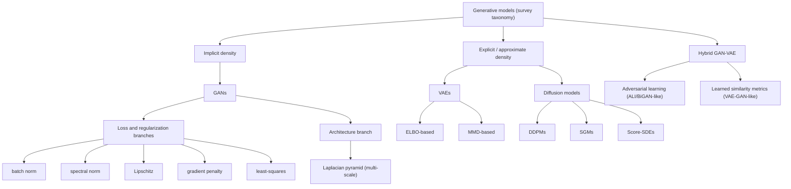
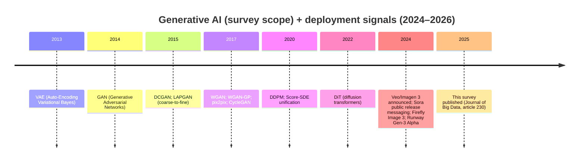

# Deep Research Report on “Generative AI in Depth: A Survey of Recent Advances, Model Variants, and Real-World Applications” (2025)

## Executive summary

This 2025 survey (published as an open-access article) systematizes a vision-centric slice of “generative AI” by focusing primarily on deep generative models for image and video synthesis—especially GANs, VAEs, diffusion models, and hybrid GAN–VAE approaches—while also touching on broader societal/ethical concerns induced by synthetic media.

The paper’s central intellectual move is a taxonomy anchored in a maximum-likelihood framing: it splits generative models into implicit-density approaches (GANs) versus explicit/approximate-density approaches (VAEs and diffusion models), then refines each family into branches by loss/regularization or formulation (e.g., WGAN/WGAN-GP, LSGAN, spectral normalization; DDPM/SGM/score-SDE).

Empirically, the survey does not introduce new experiments; instead, it curates prior work via a large comparative table (Table 1) organized by model type, method, datasets, and application domains (computer vision, healthcare, autonomous systems, robotics/simulation, etc.). It explicitly states no datasets were generated or analyzed in the study.

The survey’s declared future directions emphasize (i) GAN training stability and mode coverage, (ii) VAE posterior-collapse issues, (iii) diffusion efficiency (slow, multi-step sampling; sensitivity to noise schedules), and (iv) the need for ethical safeguards (deepfakes, provenance, regulation).

From an independent critical perspective, the paper’s biggest practical gap for engineers is evaluation: it discusses several objective terms and fairness metrics (e.g., MSE, Dice, SPD/EOD/DEO/AOD) but does not provide a unified, multimodal evaluation protocol for generative quality, prompt adherence, controllability, robustness, and provenance—and notably does not mention FID in the PDF.

Reading date: 2026-03-14 (Asia/Tokyo).

## Primary-source identification and bibliographic record

### Official citation, publisher DOI, and publisher PDF

The version of record is published in Journal of Big Data (Survey; Open Access) with article number 230 in volume 12 (2025), published 08 Oct 2025.

Official bibliographic citation (publisher-provided format):
Yazdani, S., Singh, A., Saxena, N. *et al.* (2025). *Generative AI in depth: A survey of recent advances, model variants, and real-world applications.* *J Big Data* 12, 230. https://doi.org/10.1186/s40537-025-01247-x.

Publisher DOI (official): **10.1186/s40537-025-01247-x**.

The article is distributed under a Creative Commons Attribution 4.0 license (CC BY 4.0) as Open Access.

### arXiv preprint record and arXiv DOI

The paper is also available as an arXiv preprint: arXiv:2510.21887.
arXiv DOI (DataCite): **10.48550/arXiv.2510.21887**.

### Institutional repository / university record

An institutional metadata record exists at Florida International University (FIU Discovery), listing the DOI and publication date; it does not (in the visible record) provide a hosted PDF, pointing instead to the DOI.

### Official PDF/URL links and DOIs (code block)

```text
Publisher (Springer Nature) landing page:
https://link.springer.com/article/10.1186/s40537-025-01247-x

Publisher PDF (SpringerOpen / Journal of Big Data):
https://journalofbigdata.springeropen.com/counter/pdf/10.1186/s40537-025-01247-x.pdf

Publisher DOI:
https://doi.org/10.1186/s40537-025-01247-x

arXiv abstract page:
https://arxiv.org/abs/2510.21887

arXiv PDF:
https://arxiv.org/pdf/2510.21887

arXiv DOI:
https://doi.org/10.48550/arXiv.2510.21887

Institutional metadata record (FIU Discovery):
https://discovery.fiu.edu/display/pub539901
```

## What the paper says and contributes

### Abstract and problem framing

The abstract frames a rapid expansion of generative-model research (GANs, VAEs, diffusion models) and argues that growth in publications, applications, and unresolved technical challenges makes it hard to stay current. The paper proposes a “comprehensive taxonomy” to organize variants and combined approaches, highlights innovations improving output quality/diversity/controllability, discusses ethical concerns around synthetic media misuse, and outlines future research directions.

### Introduction: scope, motivations, and core trade-offs

The introduction positions generative AI’s practical implications across domains including art, entertainment, gaming, design, medicine, and data augmentation, and centers three architectural families: GANs, VAEs, and diffusion models.

It explicitly contrasts their typical failure modes: GAN training instability (including mode collapse or non-convergence), VAE blurriness induced by pixel-wise reconstruction losses, and diffusion models’ computational inefficiency at inference—often requiring “hundreds to thousands” of denoising steps per sample.

### Organization / survey method

The paper is a structured literature survey, not an experimental study. It states a sequential organization: taxonomy → GANs → VAEs → diffusion models → hybrid approaches → applications/impacts → ethical considerations → challenges/future directions → conclusion.

The survey’s evidence base is operationalized through Table 1, which summarizes work along four dimensions—Type, Method, Datasets, Applications—explicitly focused on image and video synthesis.

### Claims of key contributions

The paper enumerates contributions including (i) a taxonomy spanning GANs, VAEs, hybrid GAN–VAE, and diffusion models; (ii) a systematic review emphasizing high-quality/diverse image and video generation and stable training; (iii) comparison of strengths/limitations across families and variants; (iv) integration of technical advances with real-world applications; and (v) treatment of ethical implications plus future research directions.

## Taxonomy, variants, datasets, and evaluation metrics

### Taxonomy of model variants

The taxonomy splits generative models into two branches based on a maximum-likelihood principle:
- implicit density: GANs
- explicit / approximate density: VAEs and diffusion models.

Figure 1 (taxonomy diagram) further structures:
- GANs: “six branches” driven by (1) loss functions and regularization (batch/spectral normalization, Lipschitz continuity enforcement, gradient penalty, least-squares loss) and (2) multi-scale architecture (Laplacian pyramid).
- VAEs: two branches based on ELBO vs MMD techniques.
- Hybrid GAN–VAE: two branches based on adversarial learning (ALI/BiGAN-style) vs learned similarity metrics (discriminator-feature reconstruction, VAE-GAN).
- Diffusion models: three branches by formulation—DDPMs, score-based generative models (SGMs), and score-SDEs.

Mermaid reconstruction of the paper’s taxonomy (conceptual re-expression of Figure 1):



### Datasets and benchmarks emphasized

The survey’s Table 1 provides the most concrete “benchmarks map” by pairing methods with datasets and application classes. Representative dataset coverage includes (non-exhaustive, but directly taken from Table 1):

- image-to-image translation / semantic segmentation: Cityscapes; CMP Facades; edges via HED; map imagery;
- object detection: COCO; WIDER FACE;
- text-guided image editing / artistic generation: CelebA-HQ; ImageNet; MS-COCO; PaintByWord; WikiArt; Yahoo Flickr Creative Commons 100M; Conceptual 12M;
- video generation and simulation: BAIR; KTH Actions; CARLA Town01; MineRL Navigate; GQN-Mazes; “101 Human Actions”;
- 3D / asset generation: ShapeNet; PartNet (including PartNet Mobility / GAPartNet in robotics contexts);
- healthcare / medical imaging: MIMIC-CXR; CSAW-M; UK Biobank; IXI; fastMRI; OCT;
- protein structure prediction: PDB IDs referenced in a diffusion-model paper;
- environmental simulation: MODIS; VIIRS (via a 3D VQ-VAE example).

The paper also highlights deepfake/manipulation benchmarking work (e.g., FaceForensics++-style evaluation) that includes manipulation methods such as DeepFakes, Face2Face, FaceSwap, and NeuralTextures.

### Evaluation metrics discussed in the paper

The paper’s “metrics” discussion is distributed across model-family sections and an ethics/fairness subsection, rather than consolidated into a single benchmarking framework.

Within modeling objectives and training losses, the paper emphasizes:
- Wasserstein distance (WGAN) as a meaningful training signal stabilizing GAN training; gradient penalty (WGAN-GP) as a Lipschitz enforcement method; least-squares loss (LSGAN) as mitigating vanishing gradients; spectral normalization (SNGAN) as controlling discriminator Lipschitz constant with less hyperparameter burden.
- ELBO / KL divergence as the standard VAE objective family, alongside MMD-based alternatives (MMD-VAE) replacing the KL term to address issues like posterior collapse.
- Diffusion training typically simplified to a noise-prediction MSE objective (L_simple), and extensions like “Improved DDPM” adding auxiliary losses (learned noise schedule, variational lower-bound loss on SNR, hybrid losses including “perceptual metrics”).

In application evaluation and fairness, the paper explicitly names:
- Dice performance metrics (medical segmentation fairness analysis).
- Statistical Parity Difference (SPD), Equal Opportunity Difference (EOD), Difference in Equalized Odds (DEO), Average Odds Difference (AOD), and MSE as part of fairness-loss design and evaluation.

Notably, the PDF contains no mention of “FID” (a widely used generative image-quality metric in the diffusion/GAN literature), suggesting the survey’s evaluation discussion is not centered on the most common modern CV generative benchmarks.

## Comparative table of major model variants covered

The table below translates the paper’s taxonomy and the most directly described variants into an engineering-oriented comparison. When the survey does not specify dataset scale or compute quantitatively, fields are marked “unspecified” per instructions.

| Model variant (as treated in the survey) | Architecture / formulation | Typical training data scale (survey) | Compute (training / inference; qualitative) | Typical tasks (survey examples) | Strengths | Weaknesses |
|---|---|---|---|---|---|---|
| GAN (baseline) | Generator vs discriminator adversarial objective | unspecified | training can be unstable; inference typically fast (single forward pass) | broad image/video synthesis | sharp, high-fidelity outputs (as contrasted with VAE blur) | instability, mode collapse, vanishing gradients, non-convergence risks.  |
| DCGAN | CNN GAN with architectural constraints + BatchNorm; strided / transposed conv | unspecified | improves stability vs vanilla GAN; inference fast | image synthesis, style transfer, data augmentation | stabilizes adversarial training; improved output quality | mode collapse can persist.  |
| WGAN | Critic estimates Wasserstein (Earth Mover’s) distance; Lipschitz via weight clipping in original form | unspecified | more stable loss signal; inference fast | general image synthesis | smoother gradients; meaningful learning curves; improved stability | Lipschitz enforcement via clipping can cause optimization difficulties / poor samples.  |
| WGAN-GP | Gradient penalty replaces weight clipping for Lipschitz constraint | unspecified | more stable training; inference fast | robotics gesture generation; other synthesis | improved convergence + sample quality; less fragile training | still requires care; does not eliminate all GAN pathologies.  |
| LSGAN | Least-squares (MSE-like) loss replaces BCE to mitigate vanishing gradients; Pearson χ² link | unspecified | stabilizes gradient signal; inference fast | general image synthesis | stronger gradients when discriminator is confident; improved convergence | does not inherently solve all adversarial instabilities.  |
| SNGAN (spectral normalization) | Spectral norm normalization controls discriminator Lipschitz constant | unspecified | stabilizes discriminator with reduced hyperparameter tuning burden | general synthesis | more reliable gradients; practical stability improvements | still bounded by GAN-family issues; effectiveness depends on setup.  |
| LAPGAN | Multi-scale Laplacian pyramid; conditional GAN at each level; coarse-to-fine residual generation | unspecified | multi-stage generation; each stage adversarial | high-resolution generation | decomposes task into conditioned refinements; can improve visual quality and stability | cascaded design adds complexity; training multiple generators/discriminators.  |
| VAE (baseline) | Latent-variable model optimized via ELBO (reconstruction + KL) | unspecified | training generally stable; inference fast | image/video generation; representation learning | principled probabilistic framework; meaningful latent space operations | blur from pixel-wise reconstruction; posterior collapse.  |
| MMD-VAE | Replaces KL term with Maximum Mean Discrepancy (MMD) | unspecified | similar to VAE; depends on kernel/MMD computation | generative modeling with alternative divergence | mitigates posterior-collapse pressures | not a definitive solution; remains an open problem.  |
| VAE-GAN (learned similarity) | Uses discriminator feature representations as perceptual reconstruction target | unspecified | adds adversarial discriminator to VAE training; inference like VAE | image generation with improved perceptual fidelity | improves visual fidelity; reduces VAE blurriness via learned similarity | hybrid objectives complicate tuning; semantic/global-coherence issues noted in related hybrids.  |
| ALI / BiGAN (adversarial inference) | Jointly learns generator (z→x) and encoder (x→z) adversarially on pairs | unspecified | adds inference net & discriminator; inference fast once trained | semi-supervised learning; representation learning | better mode coverage; coherent joint learning; competitive downstream utility | adversarial training complexity persists; depends on discriminator behavior.  |
| Diffusion models (general) | Forward noise corruption + learned reverse denoising; likelihood-based framing | unspecified | training more stable than GANs; inference slow multi-step sampling | image, video, speech; editing | stable training and sample diversity compared to GANs | inference inefficiency: “hundreds to thousands” denoising steps per sample.  |
| DDPM | Discrete-time diffusion; objective often simplified to per-step noise-prediction MSE (L_simple) | unspecified | training uses MSE noise prediction; inference multi-step | artistic painting, text-guided editing, 3D object creation (Table 1) | strong empirical quality; clean training objective | slow sampling; many steps; variants seek speedups.  |
| SGM / score-based models | Learn score function (∇ log p); e.g., NCSN-type training and Langevin sampling | unspecified | training uses score matching; inference via iterative samplers | high-res image generation; inverse problems | principled score estimation; unifies with diffusion; diversity-preserving approaches | slow sampling; sensitive to noise schedules; motivates continuous-time unification.  |
| Score-SDE (continuous-time) | Continuous-time SDE/ODE framework unifies DDPM and SGM | unspecified | flexible noise scheduling; sampling via numerical solvers | diffusion/score unification; improved sampling theory | unifying view; enables probability-flow ODE variants | still can be resource-intensive; solver choices matter.  |
| Transformer-based diffusion backbones (U-ViT, DiT) | Transformers introduced into denoising networks; hybrid U-Net + Transformer blocks | unspecified | potential scalability benefits; inference still multi-step diffusion | high-resolution conditional/unconditional generation | better global dependency modeling; scalability and multimodality potential | local-detail capture may be harder; still inherits diffusion sampling costs.  |
| Video diffusion for autonomy (GAIA-1 example) | Video diffusion + vector-quantized representations for realistic driving scenarios | 4700 hours @ 25Hz proprietary driving data (London, 2019–2023) | autoregressive generation slower than real-time (per paper) | self-driving simulation; scenario generation; training/validation data expansion | multimodal control (text + actions); useful for diverse data generation (incl. adversarial examples) | slower-than-real-time autoregressive generation; needs parallelization.  |

## Annotated list of the paper’s most important cited works

The following ~15 works are repeatedly foundational to the survey’s taxonomy and its GAN/VAE/diffusion/hybrid sections, and (where relevant) appear explicitly in Figure 1, Table 1, or the model-variant discussions.

1. Goodfellow et al., “Generative Adversarial Networks” (2014) — establishes the adversarial learning paradigm that anchors the survey’s “implicit density” branch.
2. Kingma & Welling, “Auto-Encoding Variational Bayes” (2013) — introduces the reparameterization-based VAE training framework underlying the survey’s ELBO-based VAE branch.
3. Radford et al., “Unsupervised Representation Learning with DCGANs” (2015) — canonical architectural stabilization of GAN training, used by the survey as a core GAN variant.
4. Arjovsky et al., “Wasserstein GAN” (2017) — reframes GAN training around Wasserstein distance to improve stability and interpretability of the loss.
5. Gulrajani et al., “Improved Training of Wasserstein GANs” (2017) — WGAN-GP gradient penalty is highlighted as a practical Lipschitz enforcement mechanism.
6. Mao et al., “Least Squares GAN” (2016/2017) — motivates least-squares losses to mitigate vanishing gradients and improve convergence.
7. Miyato et al., “Spectral Normalization for GANs” (2018) — spectral normalization is treated as an efficient alternative to stabilize GAN discriminators with less tuning.
8. Denton et al., “Laplacian Pyramid of Adversarial Networks” (2015) — coarse-to-fine multi-scale generation is presented as an architectural branch in the survey taxonomy.
9. Isola et al., “Image-to-Image Translation with Conditional Adversarial Networks (pix2pix)” (2016/2017) — appears in the survey’s application table as a representative conditional GAN approach for translation/segmentation.
10. Zhu et al., “CycleGAN” (2017) — used as a named example of image-to-image translation applied in medical imaging (within the survey’s healthcare discussion).
11. Larsen et al., “Autoencoding beyond pixels using a learned similarity metric” (2015/2016) — foundational VAE-GAN hybrid using discriminator features as a learned similarity measure to reduce VAE blur.
12. Dumoulin et al., “Adversarially Learned Inference (ALI)” (2016/2017) — key hybrid-style approach adding an inference network to GANs (ALI/BiGAN), emphasized for mode coverage and downstream utility.
13. Zhao et al., “InfoVAE” (2017) — positioned as an information-theoretic hybrid bridging VAE and GAN ideas via mutual-information maximization and alternative divergences.
14. Ho et al., “Denoising Diffusion Probabilistic Models (DDPM)” (2020) — the survey’s core diffusion formulation branch; also used as a basis for Table 1 diffusion applications.
15. Song et al., “Score-Based Generative Modeling through SDEs” (2020) — provides the continuous-time unification the survey uses to link DDPMs and SGMs under score-SDE formulations.

Primary links for the annotated references (code block for convenience):

```text
GAN (Goodfellow et al., 2014): https://arxiv.org/abs/1406.2661
VAE (Kingma & Welling, 2013): https://arxiv.org/abs/1312.6114
DCGAN (Radford et al., 2015): https://arxiv.org/abs/1511.06434
WGAN (Arjovsky et al., 2017): https://arxiv.org/abs/1701.07875
WGAN-GP (Gulrajani et al., 2017): https://arxiv.org/abs/1704.00028
LSGAN (Mao et al., 2016): https://arxiv.org/abs/1611.04076
Spectral Norm GAN (Miyato et al., 2018): https://arxiv.org/abs/1802.05957
LAPGAN (Denton et al., 2015): https://arxiv.org/abs/1506.05751
pix2pix (Isola et al., 2016): https://arxiv.org/abs/1611.07004
CycleGAN (Zhu et al., 2017): https://arxiv.org/abs/1703.10593
VAE-GAN learned similarity (Larsen et al., 2015): https://arxiv.org/abs/1512.09300
ALI (Dumoulin et al., 2016): https://arxiv.org/abs/1606.00704
InfoVAE (Zhao et al., 2017): https://arxiv.org/abs/1706.02262
DDPM (Ho et al., 2020): https://arxiv.org/abs/2006.11239
Score-SDE (Song et al., 2020): https://arxiv.org/abs/2011.13456
```

## Applications, industry adoption, and critical evaluation

### Real-world applications and adoption examples mentioned in the paper

The survey’s “Application and impacts” section claims transformative use across computer vision, content creation, healthcare, autonomous systems, education/training, data augmentation/synthesis, environmental modeling and simulation, and robotics/humanoid systems.

Concrete examples named in the paper include:
- Healthcare: an open-source MONAI “generative models” framework for training/evaluating/deploying generative models across architectures (DMs, autoregressive transformers, GANs), plus diffusion-based MRI reconstruction (AdaDif) and diffusion-based protein structure prediction.
- Autonomous systems: GAIA-1 as a generative model for realistic driving scenarios, with 4,700 hours of proprietary driving data collected in London (2019–2023) and an explicit note that its autoregressive generation is slower than real-time (with parallelization suggested).
- Deepfakes and misuse: examples include entertainment and political misinformation cases (Luke Skywalker deepfake in The Mandalorian; slowed-down Nancy Pelosi video; Obama impersonation; Zuckerberg deepfake), plus mention of consumer deepfake tool ecosystems and the need for detection benchmarks.

In provenance/authentication, the survey explicitly mentions the Coalition for Content Provenance and Authenticity (C2PA) and highlights Leica’s M11-P camera as featuring content credentials for authentication.

### Corroborating industry examples from 2024–2026 (primary/official sources prioritized)

Recent deployments align closely with the survey’s emphasis on (a) diffusion/video generation growth and (b) provenance/guardrails:

- OpenAI: Sora’s public rollout messaging emphasizes provenance signals: visible watermarking and embedded C2PA metadata to distinguish AI-generated video.
- Google: Google’s 2024 announcement introduces Veo (video generation) and Imagen 3 (text-to-image) and explicitly frames “responsible deployment” including safeguards and digital watermarks.
- Runway: The Gen-3 Alpha announcement states the model will ship with safeguards including an in-house moderation system and “C2PA provenance standards.”
- Adobe: Firefly Image 3 communications emphasize automatic attachment of “Content Credentials” to generated content, describing them as tamper-evident metadata built on the C2PA standard.
- Stability AI: Stable Diffusion 3’s official announcement provides unusually concrete model-scale details (800M–8B parameter range) and explicitly states architectural choices (diffusion transformer + flow matching), illustrating the “model variants” evolution the survey reviews at a conceptual level.

Japanese-language governance sources that connect directly to the survey’s ethics and responsible-deployment framing include the Japanese government’s AI business guidelines:
- Ministry of Economy, Trade and Industry (with Ministry of Internal Affairs and Communications): a 2024 press release explains the integration and update of multiple prior guidelines into the “AI Business Guidelines (v1.0)” to respond to rapid changes including the spread of generative AI.

For provenance standards themselves, the C2PA organization describes Content Credentials as an open technical standard to establish origin/edits of digital content.
A concrete hardware implementation example is Leica Camera AG, which states the M11-P integrates content authentication according to CAI and C2PA.
The page also names the Content Authenticity Initiative as the ecosystem context for this approach.

### Critical evaluation: strengths, limitations, and gaps

Strengths grounded in the paper:
- Coherent unifying taxonomy: the implicit vs explicit/approximate split, plus explicit branching for GAN/ VAE/ hybrid/ diffusion, provides a compact conceptual map that helps readers locate many “variant” papers.
- Strong coverage of stability/optimization motifs: the GAN section explicitly walks through canonical stabilization lines (DCGAN; WGAN/WGAN-GP; LSGAN; spectral normalization; LAPGAN), linking them to training pathologies like mode collapse and vanishing gradients.
- Practical application breadth: Table 1 spans CV, medical imaging, robotics/simulation, autonomy, and even protein structure prediction, making the survey useful as a “where has this model family been applied?” index.
- Ethics included as a first-class section, not an afterthought: deepfake examples, fairness metrics, and provenance standards are explicitly treated.

Limitations and paper-stated open problems:
- GANs: the paper states that despite many techniques, core issues (unstable training, mode collapse, hyperparameter selection) remain open problems.
- VAEs: it calls out posterior collapse as a known limitation and states that MMD-VAE and semi-supervised variants do not solve it definitively.
- Diffusion models: the paper repeatedly emphasizes slow sampling and resource-intensive training/sampling, plus sensitivity to noise schedules, motivating efficiency work.
- Hybrid models: it notes limitations such as semantic understanding deficits in some hybrid approaches, affecting global scene coherence.

Independent critical analysis (rigorous “gaps” relevant to engineering and research reproducibility):
- Evaluation protocols are not unified: the paper references objective terms (ELBO/KL, MMD, Wasserstein distance) and fairness metrics (Dice, SPD/EOD/DEO/AOD), but does not consolidate these into a practical evaluation suite for modern generative systems (quality + prompt adherence + controllability + safety/provenance + robustness).
- Missing/underweighted mainstream generative CV metrics: the PDF contains no mention of FID, despite FID being highlighted even in foundational diffusion work (DDPM’s abstract reports FID).
- Compute/data-scale comparisons are not standardized: aside from isolated scale mentions (e.g., GAIA-1’s 4,700 hours at 25Hz), most method descriptions and Table 1 entries do not report model size, FLOPs, or training compute—limiting direct “cost-performance” decision-making.
- Taxonomy consistency issues: Table 1 includes a row that labels “GPT-4” under “GAN” with “image-to-text translation,” which reads as a categorization mismatch and suggests the survey’s scope boundary between vision generative models and LLM-based systems is not always cleanly enforced.
- Ethics-to-engineering translation remains incomplete: while the paper points to provenance standards (C2PA) and specific authentication examples (Leica M11-P), the broader ecosystem problem—how provenance survives platform transcodes, how watermark/metadata robustness is tested, and how enforcement is audited—is not treated as an engineering evaluation problem (even though it is central to real deployments).

Mermaid timeline (field milestones + 2024–2026 deployment signals, compiled from paper + primary sources):



External images: none used (only Mermaid diagrams embedded).
