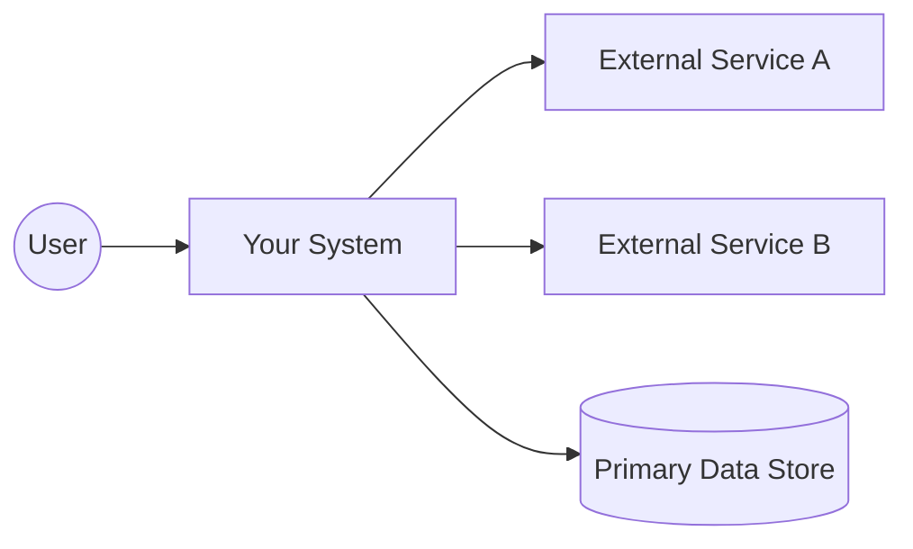
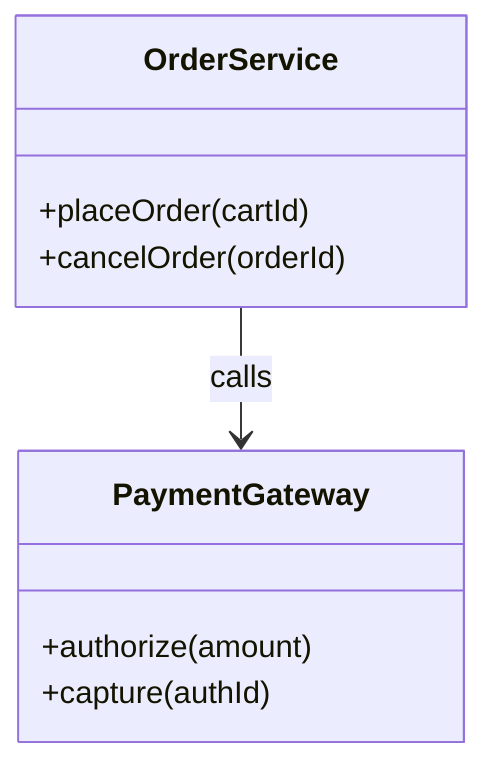
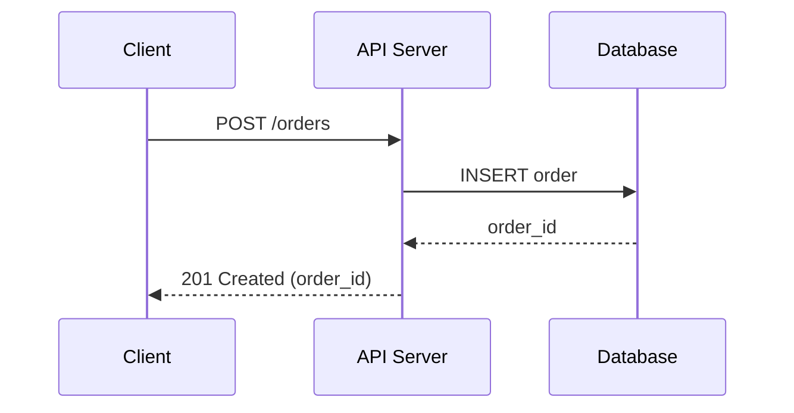

# Best Practices for Documentation in Open-Source Software vs Internal Corporate Development

## Executive Summary

Documentation strategy diverges between open-source software (OSS) and internal corporate development primarily because the audience and governance differ: OSS must onboard strangers at scale with limited shared context, while internal projects optimize for alignment, risk management, and operational continuity within a known organization.

The most robust approach in both contexts is “docs-as-code”: store docs in version control near the code, review them in pull requests, and automate checks, because documentation notoriously drifts out of date without ownership and workflow integration.

Large OSS projects demonstrate a two-layer model: (a) high-level, user-facing architecture pages (cluster components, mental model), and (b) structured design proposals (e.g., KEPs / RFCs) that capture motivation, trade-offs, risks, testing, rollout, and long-term maintenance implications.

For diagrams, the core best practice is reviewability: prefer text-backed diagrams (Mermaid/PlantUML) that diff cleanly in Git and can be rendered in code review tools (notably GitHub supports Mermaid rendering in Markdown), and use images only when you need higher fidelity than text can provide.

The main trade-off is predictable: richer documentation accelerates onboarding and reduces repeated decision debates, but it has a real maintenance cost; surveys in industry consistently report architecture documentation becoming outdated and mismatched to developer tasks, so the winning pattern is fewer, sharper artifacts with explicit owners, update triggers, and archival rules.

## How OSS and Internal Documentation Differ

The simplest way to understand “what to write” is: documentation is a compression algorithm for context. The less shared context your audience has, the more explicit and structured the documentation needs to be. OSS has the least shared context (newcomers, external adopters), so it benefits disproportionately from strong entry points such as README + CONTRIBUTING + examples + stable API reference.

Internal corporate development often has access to private channels (wikis, tickets, roadmaps, org knowledge), so it can lean on “ambient context,” but this is a trap: internal docs are still vulnerable to doc-rot, and architecture documentation is frequently reported as outdated/inconsistent and hard to navigate.

Both OSS and internal environments converge on a similar operational best practice—docs should flow through the same PR workflow as code—because that’s the most reliable way to enforce updates, shared ownership, and automation gates. This is explicitly recommended by docs-as-code guidance (version control, code reviews, automated tests) and is echoed in corporate playbooks that instruct authors to update documentation as part of a PR.

Granularity expectations differ:

* OSS typically prefers fewer “global” documents and more targeted contributor-facing artifacts (e.g., ASP-style “how to contribute,” fast contribution walkthroughs, “why” captured in structured proposals like KEPs/RFCs) to avoid maintaining long, monolithic design specs.
* Internal projects can afford deeper detail when it reduces risk (e.g., compliance, security, on-call operations), but should still avoid “one-size-fits-all” architecture documentation; the developer-driven need is task-specific, navigable documentation rather than massive static reports.

A practical framing is to treat “design docs” differently from “user docs”:

* A design doc is primarily a review artifact that captures trade-offs; after implementation it should become an archive of decisions (so you can understand “why”), not a second, half-correct source of operational truth.
* User docs and API reference are “truth artifacts” that must track releases and behavior.

## Recommended Artifact Set and What Each Should Contain

The templates and operational guidance below synthesize well-established public sources from major OSS projects and corporate guidance, including the Kubernetes KEP process and template, Rust RFC template, Django’s documentation contribution process, Google Cloud ADR guidance, GitHub community health file placement guidance, OpenAPI specification materials, and docs-as-code practices.

### Artifact catalog with purpose, audience, and recommended granularity

| Artifact | Purpose | Primary audience | Recommended content template (minimum) | Granularity & length guidance (OSS vs internal) |
|---|---|---|---|---|
| README.md | Explain why the project exists, what it does, and how to use it. | Users + evaluators + contributors. | What/Why, Quickstart, Install, Basic usage, Support channels, License; optionally “Architecture at a glance.”  | OSS: short and skimmable; “getting started” first. Internal: include environment assumptions and links to internal systems; can be longer but keep a clear “new engineer” path.  |
| CONTRIBUTING.md | Reduce friction for external/internal contributors; standardize contribution workflow. | Contributors. | How to set up dev env, how to run tests, style, PR process, where to ask; pointers to templates.  | OSS: must be explicit for strangers; internal: can lean on tooling standards but still must be actionable. Discoverability matters.  |
| Architecture overview (architecture.md / docs/architecture/) | Provide system map: core components, boundaries, data flow, operational context. | New contributors; reviewers; operators. | C4 Level 1–2 (context/containers), key dependencies, main runtime flows, invariants, glossary.  | OSS: high-level, stable, limited pages. Internal: include operational concerns (SLOs, observability, failure modes) when on-call exists.  |
| Design doc (design.md / docs/design/) | Propose or explain a significant change; capture trade-offs. | Engineers + reviewers + architecture group. | Problem, goals/non-goals, alternatives, proposed design, rollout/testing, risks. (Treat as decision archive post-merge.)  | OSS: often replaced by structured proposals (KEPs/RFCs) and smaller ADRs. Internal: may be more common due to staffing, compliance, multi-team alignment.  |
| ADRs (Architecture Decision Records) | Record a single decision + rationale so “why” survives turnover. | Future maintainers; new team members. | Context, decision, status, consequences; link to code and alternatives.  | OSS: lightweight ADRs work well when KEP/RFC is too heavy. Internal: ADRs scale across teams and are recommended to store close to code in Markdown.  |
| KEPs / RFCs (structured proposals) | Governance-backed design proposals for major changes (multi-team impact). | Maintainers + SIGs/teams + reviewers. | Standard sections like Summary, Motivation, Goals/Non-goals, Proposal, Design details, Test plan, rollout/upgrade, drawbacks, alternatives; plus metadata and status.  | OSS: appropriate for large projects; can be long (many sections) but structured. Internal: analogous to “Design Review” docs when multiple teams must agree.  |
| API reference (OpenAPI/Swagger, language API docs) | Define the public API precisely; enable tooling and client generation. | API consumers; integrators. | OpenAPI spec, examples, auth/error model, versioning guarantees.  | OSS: treat as contract; keep stable and versioned. Internal: also a contract, but often paired with SLOs, quotas, and runbooks.  |
| Docstrings / inline API docs | Document behavior at symbol level (function/class/module). | Users (API consumers) + maintainers. | PEP-style summary + details + parameters/returns/raises; keep narrative short, examples where valuable.  | OSS: critical for library ergonomics; internal: still valuable, especially with generators (Sphinx autodoc). Avoid duplicating design rationale here.  |
| Tests as executable documentation | Encode expected behavior; reduce doc-rot by making examples run. | Maintainers; contributors; reviewers. | Doctests for examples + unit/integration tests for invariants, plus “golden examples.”  | OSS: high value—new contributors learn by reading tests. Internal: also high value, especially for safety-critical behavior; link tests from docs.  |
| Tutorials / examples / “getting started” | Teach by doing; accelerate onboarding. | New users; new contributors. | Step-by-step path; minimal prerequisites; runnable examples; troubleshooting. “Tutorial vs reference” separation helps clarity.  | OSS: essential because there is no training org. Internal: essential for onboarding and for consistent ops; keep tutorials release-aligned.  |
| CHANGELOG / release notes | Communicate change; support upgrade decisions. | Users; integrators; maintainers. | “Notable changes,” curated; link to breaking changes; follow a consistent standard like Keep a Changelog + SemVer.  | OSS: strongly recommended because users upgrade independently. Internal: still useful, but may integrate with deployment logs; must map to versions/environments.  |
| Onboarding guide (internal) / “Contributor quickstart” (OSS) | Reduce repeated “how do I start?” questions. | New engineers / new contributors. | Setup, first task, key concepts, where to ask, readings, contribution path.  | OSS: keep short and action-oriented (first PR). Internal: include access, environment, runbooks, and escalation paths.  |

### Artifact operations: ownership, update frequency, storage, review, tooling

| Artifact | Update frequency & trigger | Recommended storage location | Review/approval workflow | Tooling suggestions (authoring, generation, automation) |
|---|---|---|---|---|
| README.md | On every user-visible change; keep “quickstart” always runnable.  | Repo root so it renders by default.  | PR-required; treat as public interface in OSS.  | Markdown + CI link checks; include Mermaid diagrams if helpful (diffable).  |
| CONTRIBUTING.md | When workflow/tooling changes; when newcomers hit friction.  | root / docs /.github are standard placements.  | Maintainer review; consider CODEOWNERS for docs ownership.  | Issue/PR templates for structured info.  |
| Architecture overview | On boundary changes; on new subsystems; on operational model changes.  | docs/architecture/ or architecture.md; link from README.  | PR-reviewed; use lightweight change control; may require architect/owner review.  | C4 diagrams (context/container), Mermaid/PlantUML, Graphviz; avoid brittle “whole system class diagrams.”  |
| Design docs | For major changes; archive after landing; link to ADR/KEP/RFC.  | docs/design/ with stable permalinks; keep near related modules when possible.  | Explicit approvers (tech leads/maintainers); treat as review artifact.  | Templates + markdown lint; optionally static site (MkDocs/Docsify) for navigation.  |
| ADRs | When a decision is made that will be questioned later; do not overuse.  | Prefer “close to code” (e.g., docs/decisions/ or module-local).  | PR-reviewed; keep small; require links to implementation and alternatives.  | MADR templates; markdown tooling; search-friendly titles.  |
| KEPs / RFCs | For cross-team or user-facing enhancements; lifecycle status tracked.  | Dedicated repo/area (e.g., keps/ text/); reference from issue trackers.  | Formal approvers; status transitions; PR gate before release.  | Structured templates (KEP/RFC); CI validation; link to user-facing docs.  |
| API reference | Every contract change; version with releases.  | /api/ or docs/api/; publish to docs site; keep spec near source for drift control.  | PR-reviewed; treat as public API gate; reject changes without migration notes.  | OpenAPI + Swagger UI; use generators for clients/stubs/docs when helpful.  |
| Docstrings | With every public symbol change; enforce with style lint.  | In code; generated docs should be built from source.  | Code review; ensure consistency; avoid duplicating separate design docs.  | PEP 257 conventions; Sphinx autodoc to reduce duplication.  |
| Tests / doctests | On every behavior change; examples must execute.  | tests/ plus doc tests embedded in docs/code.  | Required in PRs; treat as safety net and documentation.  | rustdoc doctests; Python doctest/pytest; link tests from docs.  |
| Tutorials/examples | Update when onboarding path breaks; validate periodically.  | examples/ or docs/tutorials/; keep runnable artifacts in repo.  | PR-reviewed; add CI “example runs” for drift prevention.  | MkDocs/Docsify for publishing; embed Mermaid diagrams for conceptual clarity.  |
| CHANGELOG | Every release; keep “Unreleased” section maintained.  | Root (CHANGELOG.md) + release pages; link from README.  | Maintainer curated; avoid dumping raw commit logs.  | Keep a Changelog format; align with SemVer and API policy.  |

## Lifecycle and Maintenance Practices

A durable documentation system is defined less by what you write and more by how it is maintained: ownership, workflow gates, and drift detection. Docs-as-code explicitly recommends using the same tools and workflows as code—version control, code reviews, and automated tests—so docs have enforceable quality controls and shared ownership.

### Who updates, and how updates are enforced

In OSS, “who updates” is intrinsically distributed: external contributors author changes, but maintainers must ensure consistency and long-term integrity. GitHub’s own guidance frames CONTRIBUTING as a core “community health” file and emphasizes standardized placement and visibility to contributors.

In internal corporate environments, roles are clearer, but documentation can still fall into a gap if “docs tasks” are not attached to delivery: Microsoft’s engineering playbook explicitly places documentation updates alongside tests and other quality steps before and during PR creation/review.

Django’s contributor documentation offers an OSS example of “treat documentation like code,” emphasizing consistency/readability and working on the development branch for “latest-and-greatest” docs, which is the same maintenance logic applied to source code.

### Review workflow and “living docs” vs archival docs

A critical lifecycle distinction is between “living” and “archival” documents:

* Living docs: README, tutorials, API reference, operational runbooks—these must remain current and should be validated (doctests, CI checks, link checks) because they are used as ground truth.
* Archival docs: design docs, ADRs, KEPs/RFCs—after implementation, these primarily preserve rationale and trade-offs and should not compete with the living docs as the “how-to” source. This aligns with Google’s doc best practices that design docs should serve as archives after the code is implemented rather than “half-correct docs.”

Kubernetes codifies this archival/living split: the KEP template explicitly includes requirements for user-facing documentation to land in the user documentation repository for publication, separate from the design proposal.

### Versioning, changelogs, and drift control

For user-facing behavior, documentation should be versioned with releases. Keep a Changelog provides a widely used structure for curated “notable changes,” and Semantic Versioning formalizes the expectation that version number changes convey meaning about API/behavior changes.

“Drift control” is the missing piece in many doc systems. Executable examples are one of the most effective defenses: Rust’s documentation tests execute documentation examples, ensuring they remain up to date and functional. Python’s doctest module similarly executes doc examples to verify they work as shown, specifically calling out docstring example validation as a common use case.

## Visual Design Artifacts and Diagram Strategy

Industry evidence shows that architecture documentation frequently becomes outdated and inconsistent and that generic, “one-size-fits-all” documentation is misaligned with developer tasks. That is a warning against producing diagrams as vanity artifacts; diagrams must be chosen for a task and maintained with a workflow.

### Choosing between C4, UML, flowcharts, ERDs, and generated diagrams

The C4 model is explicitly designed to let you “zoom” for different audiences; its own guidance notes you often don’t need all four levels and that system context and container diagrams are sufficient for most teams—this makes it particularly OSS-friendly as a stable architecture overview.

UML is a formal standardized graphical language for visualizing and documenting software artifacts; it is powerful, but the maintenance burden rises quickly if diagrams try to mirror every class or method.

Flowcharts and sequence diagrams are most effective when used to explain a specific behavior (request lifecycle, state transitions, failure modes). Mermaid explicitly supports flowcharts, sequence diagrams, class diagrams, and ER diagrams; PlantUML supports a wide set of UML diagrams including class and sequence diagrams.

Generated diagrams (e.g., Doxygen + Graphviz) optimize for “accuracy from source” (less manual drift), but often produce large, low-signal visuals that are hard to review and can mislead if readers assume generated structure equals architectural intent. Doxygen explicitly supports inheritance diagrams and can use Graphviz “dot” for more advanced graphs.

image_group{"layout":"carousel","aspect_ratio":"16:9","query":["C4 model software architecture diagram example","UML sequence diagram example","UML class diagram example","entity relationship diagram crow's foot example"],"num_per_query":1}

### Diagram diffability and reviewability in Git

Diagram maintenance is strongly shaped by whether changes can be reviewed in PRs:

* Text-based diagrams (Mermaid/PlantUML) are diffable and can be reviewed line-by-line, which aligns with docs-as-code. GitHub documents Mermaid rendering directly within Markdown across issues, PRs, wikis, and Markdown files.
* Image-based diagrams (PNG/SVG) are reviewable only via “visual diff” tooling; GitHub can display and compare images (2-up, swipe, onion skin), but the diff is not semantic (you can’t comment on “this box label changed” the way you can with text).

A practical hybrid is often best: keep the canonical source as text (Mermaid/PlantUML) and optionally render to images in CI for external publishing or when your docs site doesn’t render the syntax. This reduces doc-rot while providing consistent visuals.

### When to use each diagram type

| Artifact type | Use when | Avoid when | OSS vs internal notes | Best-fit tooling |
|---|---|---|---|---|
| C4 context/container | You need a stable architecture map for onboarding and cross-team alignment.  | You need detailed algorithm behavior. | Excellent default for OSS architecture.md because it’s stable and audience-aligned.  | C4 + Mermaid/PlantUML; whiteboard for design sessions, then codify.  |
| UML class diagrams | You need to communicate a stable domain model or API surface, not every class.  | You intend to mirror the full codebase; they drift rapidly. | For OSS, prefer small “domain model” slices. Internal: useful in regulated domains if maintained as contract.  | PlantUML or Mermaid class diagrams.  |
| UML sequence diagrams | You need to explain interactions (request flow, async events, failure handling).  | The sequence is trivial or changes frequently without stable interfaces. | Especially helpful for onboarding and incident review when tied to concrete operations.  | Mermaid sequence diagrams (renders in GitHub).  |
| Flowcharts | You need a step-by-step process, decision logic, or operational runbook.  | You try to document every branch of complex code; prefer tests/specs. | Works well for OSS “how it works” sections if kept high-level. Internal: great for runbooks.  | Mermaid flowcharts; GitHub renders.  |
| Data models / ER diagrams | You need to communicate persistent data structures and cardinality.  | The schema is generated and changes constantly without ownership. | Internal systems with multiple services benefit strongly; OSS databases benefit when users integrate directly.  | Mermaid ER diagrams; Graphviz for complex graphs.  |
| Generated diagrams | You want drift-resistant “structure views” linked to code.  | You expect them to convey intent or architectural boundaries automatically. | Use as supplemental reference, not the main architecture narrative.  | Doxygen + Graphviz dot.  |

## Comparative Tables, Decision Flowchart, and Concrete Snippets

### OSS vs internal comparison across key dimensions

| Dimension | OSS default | Internal corporate default |
|---|---|---|
| Primary audience | External users + unknown contributors; onboarding is the product’s “front door.”  | Internal engineers + adjacent teams; must support sustained operations and turnover.  |
| Governance | Maintainers/committees; formal proposal processes in large projects (KEPs/RFCs).  | Tech leads/architecture groups; design docs and ADRs often mandated for risk control.  |
| Typical doc granularity | High-level architecture overview + structured design proposals for major changes; fewer deeply detailed “global” specs.  | Can support deeper detail, but “one-size-fits-all” docs are still harmful; task-specific navigable docs perform better.  |
| Update cadence | “Doc update required” is usually enforced via PR review norms and contributor templates; release notes matter.  | Enforced via PR policy (“update docs with code changes”); may add compliance checks and internal release workflows.  |
| Preferred diagram formats | Text diagrams (Mermaid) because they render in GitHub and diff cleanly.  | Mix of text diagrams + richer tooling; images acceptable when doc system supports review and ownership.  |
| Main failure mode | Missing onboarding path (README/CONTRIBUTING/examples), leading to low adoption and contributor churn.  | Doc-rot and mismatch to developer tasks; unclear ownership; too much generic architecture content.  |

### Decision flowchart for choosing artifacts

```mermaid
flowchart TD
  A[Start: New project or significant change] --> B{Audience includes external users or contributors?}
  B -- Yes --> OSS1[OSS baseline: README + CONTRIBUTING + examples/tutorial + API reference if applicable]
  B -- No --> INT1[Internal baseline: README + onboarding guide + runbooks if on-call]

  OSS1 --> C{Project size / surface area?}
  INT1 --> C

  C -- Small (1-2 maintainers, single module) --> S1[Add ADRs for major decisions; keep architecture as short C4 context/container]
  C -- Medium (multi-module, multiple contributors) --> M1[Add architecture.md + ADR log; add design docs for major features]
  C -- Large (many teams/SIGs, long-lived platform) --> L1[Add formal proposal process: KEP/RFC-style docs + status tracking]

  S1 --> D{API stability guarantee?}
  M1 --> D
  L1 --> D

  D -- Public/stable API --> API1[Add versioned API reference (OpenAPI/rustdoc/etc) + changelog + migration notes]
  D -- Internal/unstable --> API2[Document “best-effort” API; focus on examples and integration tests]

  API1 --> E{Need diagrams?}
  API2 --> E

  E -- Yes --> DIAG1[Prefer diffable text diagrams (Mermaid/PlantUML). Use images only when necessary.]
  E -- No --> END[Prioritize tests-as-docs + docs-as-code workflow]

  DIAG1 --> END
```

### Example snippets (copy/paste starters)

ADR (lightweight “why” record) template inspired by public ADR guidance and commonly used MADR-style patterns.

```markdown
# ADR-XXXX: <Decision title>

## Status
Proposed | Accepted | Deprecated | Superseded

## Context
What problem are we solving? What constraints (security, cost, latency, team skills) matter?

## Decision
What did we decide? Be precise and link to the implementing PR(s).

## Alternatives considered
- Option A: why rejected
- Option B: why rejected

## Consequences
Positive and negative consequences, including operational impact and migration cost.

## References
Links to relevant issues, KEP/RFC/design doc, benchmarks, and discussions.
```

C4 Level-1 (System Context) sketch starter (the C4 model emphasizes multiple zoom levels and that you can often stop at context/container for most teams).



Mermaid class diagram example (supported on GitHub, and Mermaid’s class syntax is documented by Mermaid).



Mermaid sequence diagram example (useful for documenting request lifecycles and integration behavior).



OpenAPI skeleton for API documentation (OpenAPI is defined as a language-agnostic interface description for HTTP APIs; Swagger UI can render it as interactive documentation).

```yaml
openapi: 3.1.0
info:
  title: Example API
  version: 1.0.0
paths:
  /orders:
    post:
      summary: Create an order
      responses:
        "201":
          description: Created
```

### Exemplary public sources to study (official/primary where possible)

Kubernetes: user-facing architecture overview and cluster architecture pages, plus KEP process and KEP template.

Django: documentation treated like code; structured documentation process and contributor guidance.

Rust: contributor-facing compiler development guide (“quick guide”), and the formal RFC template capturing motivation and both guide-level and reference-level explanations.

React: documentation contribution guide emphasizing content structured for different learning styles/use cases.

Corporate guidance: Google’s engineering practices and documentation best practices (including design docs as decision archives), and Microsoft’s engineering playbook on documentation and PR workflows.

Academic evidence: README content studies show common gaps (e.g., missing purpose/status) and characterize README sections; architecture documentation surveys emphasize frequent outdatedness and the mismatch between generic docs and developer tasks.