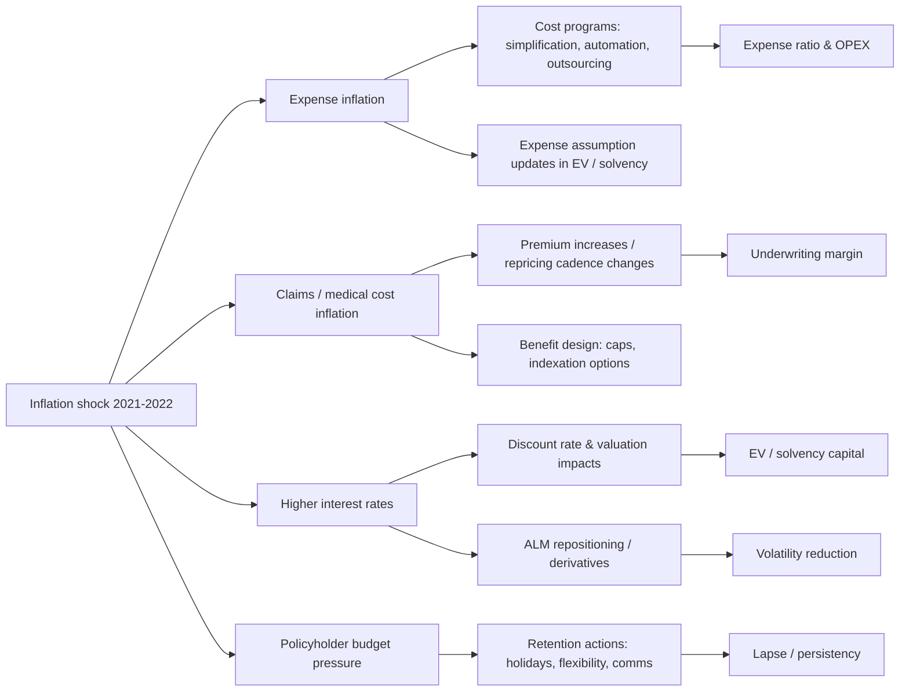

# Recent Insurer Responses to Inflation in Life and Health Insurance During 2021–2025

## Executive summary

Inflation in 2021–2022 (and the subsequent high-rate environment) created a **multi-channel shock** for life and health insurers: (i) **expense inflation** (wages, IT, servicing), (ii) **claims inflation** that is most visible in health (medical cost trends), (iii) **policyholder affordability and behavior** (premium strain, lapses/surrenders), and (iv) **discounting and market valuation effects** through interest rates, credit spreads, and asset prices. European supervisors explicitly warned that prolonged low inflation had led many insurers to **implicitly** treat inflation in models; the post‑2021 regime raised the risk of under-reserving and mispricing unless assumptions, governance and stress testing were refreshed.

Across markets where **inflation-linked products are not dominant**, insurers’ observed playbook during 2021–2025 was less about launching “pure inflation-linked” savings products and more about **operational and contractual defensives**: optional indexation on protection benefits/premiums with caps, faster pricing loops on renewable/group books, explicit policyholder communications and forbearance options, targeted ALM hedges (inflation-linked bonds / inflation swaps) where liabilities had inflation exposure, and cost base actions (automation, simplification, vendor leverage).

The best “hard” quantitative disclosures (rather than generic narrative) tended to appear in:
- **Economic-value solvency / sensitivity reporting** (e.g., Japan’s ESR and Solvency II sensitivity sets), where expense inflation, lapse stresses, and market movements are shown directly.
- **Health pricing rounds / scheme contribution announcements**, where medical inflation is translated into premium increases and sometimes phasing/deferrals for affordability.
- **Hyperinflation accounting / supervisory circulars** in markets like Türkiye, where financial reporting and prudential frameworks created “regulatory discontinuities” in how inflation adjustments were applied.

A practical research direction, implied by the evidence, is to treat “inflation response” as a **portfolio of levers** and quantify them under internally consistent assumptions: repricing cadence (months), pass-through (%), elasticity of lapses to premium increase, expense inflation beta to wage growth, hedge effectiveness on inflation-sensitive liabilities, and distribution/servicing interventions that reduce avoidable lapses. EIOPA’s inflation report itself uses stylised sensitivity logic to illustrate how time lags and pass‑through drive profitability paths.

## Cross-country patterns and comparison

The table below summarises **what was actually observable** in 2021–2025 disclosures and official guidance across the requested markets, focusing on protection-oriented life/health insurers with limited reliance on “dominant” inflation-linked product structures (Chile is a deliberate exception because of the UF system).

| Market | Inflation transmission most relevant to life/health protection | Product strategy moves seen | Pricing / repricing cadence signals | Distribution / retention measures seen | ALM / investment and hedging signals | Valuation / capital signals and supervisory emphasis |
|---|---|---|---|---|---|---|
| United Kingdom | Affordability pressure → lapses; expense inflation; (for some books) inflation-sensitive liabilities | RPI/CPI-linked “increasing” options with caps in protection; customer-facing “options if struggling” messaging | Supervisors and conduct regulator stressed outcomes for customers under strain | Payment holiday / premium flexibility promoted to reduce lapses | Some groups explicitly note inflation-linked securities and inflation swaps as part of inflation risk management | PRA stress testing emphasized scenario analysis maturity; FCA set cost‑of‑living expectations for life insurers; lapse/liquidity risk highlighted for 2024 supervision  |
| United States | Wage inflation and labor markets affect group premiums and expenses; medical cost trends; higher rates shift persistency | Inflation-linked benefit increases exist in some group policies; not a dominant product form but present | Large workplace insurers state ability to reprice new/renewing business if wage inflation increases costs | More emphasis on preserving coverage and managing lapse/persistency via product options and employer relationships (disclosure tends to be indirect) | Use of inflation-linked bonds for inflation-linked benefit liabilities; inflation swaps documented where inflation-indexed liabilities exist | Filings note high inflation/high rates can affect sales and persistency; sector balance sheets show growing use of structured and alternative assets over the low-rate era and into the rate-shift period  |
| Japan | Expense inflation (new in Japanese context), policyholder behavior, and market-rate effects; solvency framework transition | Emphasis on enterprise value / economic-value frameworks; less visible retail “indexation product” redesign in public docs | More disclosure on behavioral shifts and solvency sensitivities than rapid repricing as a headline theme | Indirect: improved awareness of surrender/lapse risk and risk controls; reinsurance used as a solvency stabilizer ahead of ESR | ALM and risk frameworks discussed; ESR and enterprise value disclosures become central | ESR introduction scheduled for FY2025; disclosures show expense assumption changes due to inflation affecting ESR; authorities emphasize adoption of economic-value solvency and better risk-based supervision  |
| EU/EEA | Expense inflation; lapses/surrenders from rate rises; health claims inflation; reserve adequacy risk | Supervisory expectation: explicit inflation in best estimate, review of policyholder behavior assumptions | Emphasis on governance, evidence-based pricing response, and ORSA integration | “Cost of living” noted as potential lapse trigger | Investment valuation risk for assets not reflecting inflation; internal model parameter review | EIOPA flagged declines in own funds/SCR in 2022 and emphasised reassessment of inflation assumptions, SCR calibration, and stress tests/ORSA  |
| Chile | UF-linked indexation channels inflation mechanically into many long-term contracts; profitability depends on asset/UF-liability matching and regulation | Inflation indexation embedded via UF unit of account | Premium and reserve reporting often in UF; insurer disclosures frequently show UF-denominated KPIs | Affordability themes exist but indexation reduces “silent erosion” of benefits | UF architecture supports local-currency long-duration markets | Central bank defines UF as CPI-linked and published daily; insurer results show UF reporting and inflation-indexed line items  |
| Türkiye | Very high inflation / reporting distortions; affordability and pricing instability; accounting regime interactions | Product redesign is less visible publicly; reporting and capital rules dominate discussion | Frequent repricing implied; but public disclosures emphasize inflation accounting treatment | Consumer strain is structurally high; retained coverage often depends on payment flexibility and regulatory rules | Hyperinflation accounting and currency effects shape investment reporting | Insurance regulator circulars set/changed dates for inflation accounting application (TAS 29) and then suspended it for insurers in 2025; groups with Turkish operations disclose hyperinflation translation approaches  |
| Emerging markets (illustrated by South Africa, India) | Medical inflation and affordability (health); household budget pressure affecting protection; distribution economics | Pricing and benefit design emphasis; product mix shifts when consumers trade down | Health schemes/insurers translate medical inflation into annual/seasonal premium actions | Deferrals and phased increases (health); consumers reduce coverage/sum assured when budgets tighten (life) | Hedging frameworks discussed more than inflation-specific hedges | Regulators also move on expense/commission frameworks, giving insurers flexibility and constraints in cost control  |

Mermaid diagram below links the *inflation shock* to *observed insurer levers* and *financial outcomes*.



## Case studies from public sources during 2021–2025

The following cases were selected because they contain **concrete measures** (contract features, disclosed hedges, sensitivity sets, or quantified impacts) rather than only general narrative. They are not intended to be an exhaustive list of all insurers.

| Country / market | Company | 2021–2025 timeline (publicly visible) | Concrete measures taken (mapped to requested action areas) | Quantitative impact disclosed (examples) | Primary sources |
|---|---|---|---|---|---|
| UK | Aviva | 2022: inflation risk framed explicitly in risk disclosures; 2023: cost actions reported as offsetting inflation | **ALM / investment:** inflation risk managed via *inflation-linked securities* and derivatives including *inflation-linked swaps*; monitored through capital modelling, sensitivity and stress/scenario testing. **Expense management:** baseline controllable cost program described as offsetting inflation. | “Baseline controllable costs … down 1% … more than offsetting inflation” and cost reduction target delivered early.  | Inflation risk definition and hedge instruments in annual report.  Cost program disclosure in results announcement.  |
| UK | Legal & General | 2022–2025: cost-of-living customer support expectations intensify; product literature highlights indexation features; solvency disclosures show resilience metrics | **Product strategy:** “increasing plan” ties premium and benefit to inflation (RPI mechanism) with a cap (premium increase max 15% p.a.). **Retention:** customer-facing guidance includes a 3‑month payment holiday option (eligibility-based). **Capital:** Solvency II coverage ratio and sensitivity disclosures in results packs. | Indexation rule and cap disclosed in policy booklet.  Payment holiday described as three‑month break with later collection.  Solvency II SCR coverage ratio shown (224% at 31 Dec 2023).  | Policy terms booklet.  Customer payment holiday guidance page.  2023 preliminary management report / analyst pack with Solvency II metrics.  |
| US | MetLife | 2023: explicit discussion of inflation effects in 10‑K/annual report narrative | **Pricing / repricing:** notes that in group life/disability premiums tend to rise with compensation levels; acknowledges profitability pressure if expense inflation cannot be passed through. **Risk framing:** states inflation has had no material effect except via rates; expects neutral to modest impact overall. | Qualitative: inflation described as neutral to modest; channels described (premium linkage to compensation; expense pressure; fixed-income valuation).  | Annual report / 10‑K discussion of “Effects of Inflation.”  |
| US | Unum Group | 2022–2023: inflation-linked benefit policies drive asset choice; 2023: repricing ability stated; inflation-linked experience impacts benefit ratio | **Product strategy:** certain group policies provide inflation-linked increases in benefits; insurer holds inflation index-linked bonds to support associated claim liabilities. **ALM / investment:** inflation index-linked bonds impact net investment income; benefit impacts partially offset. **Pricing cadence:** highlights ability to adjust prices on new and renewing business if wage inflation increases costs. | Net investment income lower due to lower income from inflation index-linked bonds; explanation explicitly connects assets to inflation-linked benefits; ability to reprice due to wage inflation is stated.  | Annual report (inflation index-linked bonds; repricing for wage inflation).  |
| US | Prudential Financial | 2022–2023: narrative framing of high inflation / high rates affecting consumer behavior | **Risk / distribution / persistency:** filings note higher inflation and higher rates can shift consumer sentiment and behavior, adversely affecting sales and persistency of savings and protection products. | Qualitative disclosure; itemises sales/persistency risk from inflation/high rates.  | 2023 Form 10‑K risk disclosure excerpt on inflation and persistency.  |
| US | John Hancock Life Insurance Company (U.S.A.) | 2021–2023: statutory-basis reporting documents inflation swap usage | **ALM / hedging:** discloses use of inflation swaps to reduce inflation risk from inflation-indexed liabilities; describes classification and hedge relationships. | Explicit statement of inflation swaps usage and purpose.  | Statutory-basis financial statements / notes (SEC-hosted).  |
| Japan | Dai-ichi Life Holdings | FY2023 (ended Mar 2024): ESR movement analysis includes inflation-driven expense assumption changes | **Economic value / capital:** ESR movement bridge attributes a negative contribution to “expense assumptions changes due to inflation” (and related items). **Risk management:** also flags lapse risk changes and ongoing risk control. | ESR shown at 226% at end‑Mar 2024 vs 212% prior year; inflation-related expense assumption changes shown as roughly −3 percentage points in the ESR bridge (as depicted).  | Financial results material with ESR bridge.  |
| Japan | Meiji Yasuda Life Insurance | FY2024 (Japan fiscal year): results show business expense growth; enterprise value lens via “Group Surplus” | **Expense management lens:** business expenses disclosed (up year‑on‑year). **EV / valuation:** “Group Surplus” disclosed as an enterprise value indicator aligned with economic-value solvency discussions and ESR measurement changes. | Business expense line item disclosed as +12.6% YoY in FY2024 results (Japanese disclosure).  Group Surplus at Mar 31 2024: 10,320 bn yen (+29.5% YoY).  | FY2024 results highlights (Japanese).  Group Surplus disclosure (English).  |
| Japan | Nippon Life Insurance Company | 2023–2024: public results materials emphasise product mix and premiums (less explicit inflation narrative) | **Scope note:** available public EN/JP materials are more KPI-focused; inflation response is inferred mainly through governance/ERM and macro framing rather than explicit “inflation actions”. | New policy and segment KPIs disclosed; limited explicit inflation actions in the sampled documents.  | Six-month results English release; full-year results Japanese pack.  |
| EU (Italy) | Generali | 2022: inflation-related reserve strengthening referenced; 2023: higher discounting and finance expense effects from rate moves | **Valuation / reserving:** presentation explicitly notes inflation-related reserve strengthening in 2022. **Discounting / reporting:** notes increased current-year discounting thanks to higher rates; higher insurance finance expenses in 2023 due to 2022 rate rise. | Direct statement of “inflation-related reserves strengthening” (2022) and discounting changes.  | 2023 results presentation and commentary.  |
| EU (Austria + CEE + Türkiye exposure) | Vienna Insurance Group | 2022–2023: high-inflation CEE and Türkiye exposure; 2023: premium growth in life and health; Turkish reporting under hyperinflation accounting | **Pricing / growth:** premiums reported up in health and life; Türkiye segment growth reported “adjusted for inflation” in communications. **Financial reporting / capital interaction:** annual financial report notes Türkiye premium translation consistent with hyperinflation accounting approach; Turkish acquisitions consolidated. | Premiums up 7.5% for health and 2.7% for life in FY2023; Türkiye segment premium growth reported and “adjusted for inflation”.  Annual report notes Türkiye premium conversion at closing rate in accordance with hyperinflation accounting.  | FY2023 press release; annual financial report with Türkiye translation note.  |
| Chile | Confuturo | 2024: public English press release reports earnings/premiums and UF reporting | **Indexation context:** insurer KPIs shown in UF (gross written premiums in UF thousands), consistent with Chile’s inflation-indexed unit convention. **Business performance:** profit and premium growth reported. | Semi-annual profit up 27.3% YoY; annuity premium income and voluntary pension savings premium income growth also reported; UF KPI tables shown.  | English press release (parent holding) with insurer KPIs (UF, profit).  |
| Türkiye | Anadolu Hayat Emeklilik | 2023–2025: explicit reporting of insurance supervisor circulars on inflation accounting transition and suspension | **Regulatory / reporting interaction:** notes that the insurance supervisor issued multiple circulars (2023/30, 2024/10, 2024/32) determining that insurers would not apply TAS 29 inflation adjustment as of Dec 31 2023, later setting then repealing a 2025 transition, ultimately deciding inflation accounting would not be applied by insurers in 2025. | The circular timeline and dates are disclosed in the notes; this is a concrete example of “capital/reporting interaction” in a high-inflation economy.  | Consolidated financial statements note on TAS 29 and supervisor circulars.  |
| South Africa | Discovery Health Medical Scheme | 2023: contribution increases explicitly tied to medical inflation; deferral to support affordability | **Pricing:** contribution increase set to match expected medical inflation. **Retention / affordability:** three‑month deferral of increases (members pay prior-year rates for initial period). | Weighted average contribution increase 8.2% for 2023; deferral described.  | Contribution increase FAQ + press release.  |
| India | HDFC Life | 2022: management explicitly links inflation to weaker retail protection flows; notes consumer trade-down/deferral | **Distribution / demand management:** call transcript explains elevated inflation did not materially impact savings products, but retail protection inflows were tepid due to tight household budgets; consumers reduce sum assured or defer purchases (a “benefit slide” behavior). **Expense lens:** transcript references expense impact on margins in quarter. | Qualitative but specific: inflationary pressure reduces protection inflows; consumers adjust cover size/timing.  | Q1 FY2023 call transcript (July 2022).  |

Context sources used to interpret and compare insurer actions: EIOPA inflation supervisory statement and sector report; UK prudential and conduct letters; Japan ESR/FSAP materials; Chile UF methodology; and sector-level US investment composition reporting.

## Quantitative synthesis and scenario simulations

### Disclosed quantitative signals that are “closest to inflation response”

The disclosures below are **not directly comparable** (different units and accounting bases), but they are valuable because they reveal **where inflation entered reported metrics**.

- Expense inflation shows up directly in solvency sensitivity design (permanent expense level and expense inflation shocks).
- Inflation-driven expense assumption updates can reduce economic-value solvency ratios (Japan ESR bridge).
- Medical inflation often passes through to premium/contribution increases and may be phased/deferrred to manage affordability.
- Inflation-linked benefits in group policies affect both liability outgo and the choice/behavior of inflation-linked assets.

### Illustrative scenario model: repricing cadence vs one-year margin under inflation

This is a **simplified deterministic simulation (author)** to quantify why insurers emphasize **repricing cadence** during inflation shocks and why regulators focus on governance around pricing and assumptions. It is designed to support planning and research direction; it is not an empirical estimate of any one insurer’s results. EIOPA similarly frames parts of its work as stylised sensitivity calculations.

**Assumptions (author):**
- A protection/employee-benefits book with starting-year premium = 100.
- Expected claims + expenses = 90 (so baseline underwriting margin = 10).
- Inflation shock increases claims + expenses proportionally by *i* during the year.
- Premium rate changes are only implemented after a lag (3, 6, or 12 months), so average premium in the year rises with shorter lag.

Under these assumptions, annual underwriting margin (as % premium) becomes approximately:
- **12-month lag:** margin ≈ 10 − 90·i
- **6-month lag:** margin ≈ 10 − 40·i
- **3-month lag:** margin ≈ 10 − 15·i

```mermaid
xychart-beta
  title "Illustrative one-year margin vs inflation under repricing lag (author model)"
  x-axis "Inflation rate" [0, 5, 10, 15]
  y-axis "Underwriting margin (%)" -5 --> 12
  series "12-month repricing lag" [10, 5.5, 1.0, -3.5]
  series "6-month repricing lag"  [10, 8.0, 6.0, 4.0]
  series "3-month repricing lag"  [10, 9.25, 8.5, 7.75]
```

**Implication for research direction:** if a firm can move a meaningful slice of its book from “annual catch-up” to “mid-year / quarterly catch-up” (even if not perfectly), the value impact at 10–15% inflation is dominated by **time lag** more than by the precise long-run pass-through. This is consistent with supervisory emphasis on timely re-estimation and evidence-based pricing governance.

### Economic-value / solvency sensitivity as an inflation “measurement backbone”

A practical, evidence-based way to anchor internal quantification is to treat **Solvency II sensitivity sets** (and Japan ESR frameworks) as the central measurement language for inflation levers:
- Example sensitivity structure: permanent +5% expense level increase plus +0.5% expense inflation increase; +10% lapse shift; interest-rate shocks.
- Japan ESR disclosures show how “expense assumption changes due to inflation” translate into **percentage-point impacts** on the ESR movement bridge.
- EIOPA warns that in a high inflation world, insurers should reassess not only inflation itself but also **policyholder behavior assumptions** (e.g., lapses/surrenders triggered by cost-of-living).

This suggests a research path where inflation response is modelled as *a set of linked sensitivities* rather than a single “inflation assumption”: expenses, claims trend (health), lapses, and investment yields/rates.

## Regulatory, capital, and economic-value interactions to explicitly include in the research scope

In recent inflation episodes, “what insurers did” was partly constrained or shaped by **supervisory expectations, reporting frameworks, and stress testing**.

In the EU/EEA, the inflation supervisory statement stresses: re‑evaluating inflation expectations in technical provisions, recognizing that cost-of-living can trigger lapses and surrenders in life insurance, ensuring inflation reflection in pricing is justified and well governed, reviewing internal model inflation parameters or standard formula appropriateness, and updating stress tests/ORSA to reflect the inflation regime.

In the UK, the prudential supervisor’s stress-test feedback indicates inflation was not explicitly stressed in the core quantitative scenario (given scenario design timing), but insurers were asked to provide a qualitative assessment, and the prudential supervisor explicitly stated that higher inflationary environment implications would be considered in future stress tests. It also provides an aggregate life sector SCR coverage fall under the stress scenario (from 162% to 123%), underscoring why firms’ internal scenario capability matters.

In the UK conduct regime, the cost-of-living letters set expectations for how life insurers should support customers in difficulty, including making customers aware of options if they have trouble paying premiums (particularly relevant for pure protection). Subsequent guidance on customers in financial difficulty links cost-of-living pressures to observed cancellations/reduced cover among insurance and protection customers and clarifies expectations under the Consumer Duty framework.

In Japan, both central bank analysis and IMF FSAP documentation emphasize that an economic value-based solvency regime (ESR) is scheduled for fiscal year 2025 and is intended to address shortcomings of existing solvency requirements. Supervisory monitoring notes also reference reinsurance usage as part of ESR improvement/stabilization ahead of implementation.

In Türkiye, insurer financial statements document regulator-issued circulars that repeatedly changed the transition approach to inflation accounting for insurers and then decided not to apply it in 2025, illustrating a “regulatory reporting overlay” on top of economic inflation risk. For research, this means profitability and capital data may require **normalisation** to separate economic effects from accounting regime shifts.

In Chile, the Central Bank’s definition of UF—a CPI-indexed unit calculated and published daily—implies a structural difference: indexation is **built into the unit of account**, so “inflation response” often looks like asset/liability UF matching and governance rather than renegotiating nominal terms.

## Countermeasure menu with estimated quantitative benefit ranges

This section translates observed actions into a structured countermeasure set and provides **illustrative benefit ranges** to guide prioritisation. Where ranges are numeric, they are from the **author model** described below and should be calibrated to each insurer’s mix, constraints, and market structure; disclosures and supervisor guidance indicate the right mechanism (time lags, assumption refresh, lapse triggers) but do not provide a single universally applicable coefficient.

**Baseline modelling assumptions for benefit ranges (author):**
- A protection book with baseline underwriting margin 8–12% of premium before inflation shock.
- Expense inflation shock: 5–12% annualised; claims/health trend shock: 5–15% annualised depending on line.
- Pass-through feasible on in-force business: 50–100% over 12 months (varies by competitiveness/regulation).
- Lapse elasticity: +0.2 to +1.0 percentage points lapse rate per +10% premium increase (highly product/channel dependent; to be empirically estimated internally).
- Discounting and capital impacts assessed through an economic-value sensitivity set (expense, lapse, rates) consistent with Solvency II/ESR style reporting.

| Countermeasure area | Specific countermeasure | Implementation pattern evidenced in 2021–2025 | Estimated quantitative benefit range (author, under above assumptions) | Key caveats / dependencies |
|---|---|---|---|---|
| Product strategy | Optional benefit/premium indexation with caps/floors (for protection) | UK product literature shows inflation-linked increasing options and caps (e.g., RPI-linked with max annual premium increase).  | Long-run underwriting margin improvement +0.5 to +2.0 pp (if indexation uptake is meaningful and cap not binding in typical years); reduced “silent benefit erosion” risk | Requires clear communication and governance; cap may bind under high inflation; may increase affordability strain and lapse risk without retention tools  |
| Product strategy | Benefit “slide” / trade-down pathways (reduce cover not lapse) | Call transcript shows customers reducing sum assured or deferring protection purchase under inflation strain, implying need for formalised trade-down routes.  | Persistency improvement: reduce shock lapses by 5–20% relative (portfolio-dependent), improving 1-year profit +0.2 to +1.0 pp of premium | Requires admin capability and distribution incentives aligned; may worsen anti-selection if not designed carefully |
| Pricing / repricing | Shorten repricing lag (annual → semiannual/quarterly) where contractually possible | Workplace benefits insurers highlight ability to reprice new/renewing business; supervisors emphasise timely adjustment and governance.  | In-year underwriting margin improvement at 10% inflation: +2 to +6 pp depending on lag shift (per illustrative chart) | Competitive pressure may limit pass-through; regulatory review in health; operational billing constraints |
| Pricing / repricing | Add contractual premium adjustment clauses (where allowed) + transparent triggers | Seen in inflation-linked protection options and in regulated premium rounds for health; regulators focus on fair outcomes and evidence.  | Reduce “pricing surprise” volatility; can reduce capital strain from underpricing by 2–10% of solvency buffer in stress scenarios (order-of-magnitude) | Requires strong customer outcome framing; may be constrained by local regulation and product type |
| Distribution / retention | Premium holidays / payment deferrals + structured catch-up | UK customer guidance explicitly offers payment holiday; health schemes deferred increases to support affordability.  | Reduce lapse spike during inflation peaks; EV benefit +0.1 to +0.8% of in-force value for affected cohorts (high variance) | Must manage “arrears” and re-collection; risk of adverse selection if only higher-risk customers use options |
| Distribution / retention | Proactive “options pack” at missed-payment triggers (reduce frictional lapses) | FCA expects insurers to make customers aware of options if difficulty paying premiums.  | Reduce avoidable lapses 5–15% among delinquent segment; improves customer outcomes and reduces acquisition strain | Requires call-center/servicing capacity; must stay within conduct rules and avoid mis-selling |
| ALM / investment | Map inflation-sensitive liabilities and hedge with inflation-linked bonds / inflation swaps where exposure exists | Aviva cites inflation-linked securities and inflation-linked swaps for inflation risk management; John Hancock discloses inflation swaps for inflation-indexed liabilities; Unum holds inflation index-linked bonds for inflation-linked benefits.  | Reduce capital/earnings volatility from inflation-linked liabilities by 20–70% of the unhedged inflation sensitivity (hedge effectiveness dependent) | Hedge basis risk; liquidity/collateral management; governance and accounting treatment complexity |
| Expense management | Multi-year cost program designed to “beat inflation” (automation, simplification, vendor renegotiation) | Aviva reports baseline controllable costs down despite inflation; regulators and industry briefs emphasise explicit inflation assumptions and cost-model updates.  | If sustained cost improvement of 1–3% of expense base annually, can offset ~20–60% of a 5–10% inflation shock; improves margin +0.5 to +2.0 pp | Execution risk; one-off spend may temporarily raise expenses; requires performance management |
| EV / valuation | Refresh expense inflation assumptions, lapse assumptions, and incorporate scenario-based inflation/rate paths in ORSA/EV | EIOPA and PRA explicitly emphasise re-evaluating assumptions and stress tests; Solvency II sensitivity sets include expense inflation and lapse shocks; Japan ESR disclosures show expense assumption changes impacting ESR.  | Improves decision quality and reduces “surprise” capital hits; can shift management action timing by 6–12 months, often worth more than small assumption refinements | Not a direct profit lever by itself; value comes from better and earlier actions (pricing, hedging, retention) |
| Regulatory / capital | Capital buffer strategy aligned with inflation + lapse stress; explicit liquidity monitoring for surrender spikes | PRA 2024 priorities highlight lapse risk and liquidity reporting development; EIOPA requires ORSA integration; Japan ESR transition central to strategy.  | Avoid forced asset sales and reduce tail risk; qualitative benefit but can materially reduce downside in stress events | Depends on reporting infrastructure, governance, and product liquidity profile |

## Method and limitations

This report is a **survey of disclosed actions** and supervisory expectations during the 2021–2025 inflation episode; it relies primarily on insurer reports/filings and regulator publications. Where documents were more narrative than quantified (common in public reporting), the case study records what was explicitly stated and avoids imputing hidden actions.

Because inflation interacts with interest rates, FX, and product mix, many disclosures do not isolate “inflation effects” cleanly. Accordingly, the report separates: (i) **hard disclosures** (caps, hedges, explicit sensitivity terms, premium increase percentages), from (ii) **qualitative management commentary** (expected neutrality, demand softness, governance emphasis).

The “estimated benefit ranges” are intentionally labelled as **author assumptions** and are meant to guide internal research design—what parameters to estimate, what stress paths to run, and what operational constraints to model—rather than to claim empirical generality. Supervisory materials support the mechanism (time lags, policyholder behavior, explicit modelling and ORSA integration) but do not supply universal coefficients.
