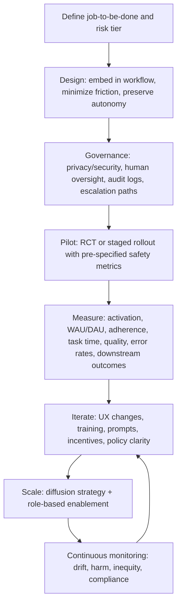

# AI Workplace Adoption: What Employees Accept, What Drives Acceptance, and What Outcomes Result

## Executive summary

Workplace AI adoption is best predicted not by abstract “AI readiness” but by a few concrete, measurable properties of the *specific* deployment: whether the AI is clearly assistive rather than evaluative, whether it is embedded into existing workflows with low friction, whether people retain meaningful control (including the right to ignore, override, or audit outputs), and whether the organization credibly governs privacy, security, and accountability. These properties repeatedly explain why “helpful” systems can still be underused: if adoption creates extra steps, ambiguous responsibility, or risk (reputational, compliance, or professional), employees rationally avoid the tool even when it is free and available.

Across high-quality evidence (field deployments, randomized trials, and production experiments) workplace AI can produce large measurable gains—but those gains are heterogeneous, concentrated among less-experienced workers, and sensitive to design details. In the best-documented customer-support field deployment (5,179 agents; ~3 million chats), access to an LLM-based assistant increased issues resolved per hour by 14% on average, with a 34% increase for novice/low-skill workers; agents’ “adherence” (following AI suggestions) rose over time, including among initially skeptical agents.

Evidence from software development shows large potential for time-to-completion gains in controlled conditions (55.8% faster completion in a randomized experiment with 95 professional developers) and meaningful real-world effects when the tool is granted in production settings (large-scale randomized field experiments with “just under five thousand” developers report an average increase in completed work on the order of ~26%).

In high-stakes clinical workflows, acceptance is increased when AI is used to *triage* and route cases (rather than replace clinicians), and when safety is demonstrated with prospective trials. In the Swedish MASAI randomized trial, AI-supported screening was reported as safe in interim analysis and reduced radiologist screen-reading workload by 44% without increasing false positives, while detecting more cancers in the AI arm.

From an organizational perspective, large surveys consistently show that “use” of genAI is widespread, but scaling and governance practices (training, KPIs, human validation processes, incentives, visible leadership role-modeling) distinguish high performers.

## Research scope and method

This report prioritizes primary sources and original empirical work (2020–2026 preferred), including randomized and quasi-experimental workplace studies, peer-reviewed clinical trials, and official or first-party industry case reports. The core empirical spine is built from: (a) workplace deployments measured on production logs (customer support; code review), (b) randomized trials in controlled or real production contexts (developer tools; clinical screening; information-worker copilots), and (c) enterprise surveys used to triangulate common barriers (governance, training, ROI ambiguity, scaling).

A key methodological point: “adoption” is not one metric. Different sources report (i) eligibility-to-activation, (ii) weekly/daily active use, (iii) adherence to suggestions, (iv) acceptance rates of AI-generated artifacts, or (v) workflow routing decisions. This report normalizes these into a structured KPI catalog and explicitly flags non-comparability where needed.

## Evaluation axes for workplace AI adoption

A rigorous adoption evaluation benefits from combining behavioral, HCI, diffusion, and governance lenses rather than treating “adoption” as a single acceptance score.

### Technology Acceptance Model and perceived value

The classic Technology Acceptance Model (TAM) frames adoption intent and use through perceived usefulness and perceived ease of use—still a practical backbone for workplace measurement (e.g., surveying usefulness, friction, and task fit, then linking responses to telemetry).

Practical TAM-aligned workplace indicators:
- **Perceived usefulness**: “Does this measurably help me finish real tasks I’m judged on?”
- **Perceived ease of use**: time-to-first-success, number of steps, context switching, error recovery.
- **Task–tool fit**: alignment with the employee’s actual workflow rather than idealized process maps.

### Human–AI interaction quality and calibrated trust

Human–AI interaction guidance emphasizes clear system status, controllability, error handling, and feedback loops—design elements strongly associated with sustained use rather than novelty adoption.

Trust is not “more is better”—it should be *calibrated* (users rely when appropriate and verify when necessary). Experimental evidence shows transparency can increase trust and reduce threat appraisals, but poorly designed explanations can also induce over-reliance.

Workplace-relevant trust metrics:
- **Appropriate reliance**: acceptance when AI is accurate; rejection when it is not.
- **Override behavior**: frequency and ease of refusing or editing AI output.
- **Auditability**: whether the user can inspect sources, diffs, or reasoning artifacts (especially in high-stakes domains).

### Nudge, friction, and “sludge” in adoption

Behavioral science distinguishes friction-reducing “nudges” from friction-increasing “sludge,” which can suppress take-up even when users benefit from the underlying option. This is a direct explanation for “we deployed something useful but employees don’t use it.”

Operationalizing friction in workplace AI:
- clicks/steps to invoke,
- interruptions to flow (context switches),
- policy uncertainty (fear of being “wrong” or non-compliant),
- reputational risk (fear AI use will be judged).

### Diffusion of innovation and organizational spread

Diffusion theory highlights that adoption spreads through observability of benefits, compatibility with existing norms and tools, trialability, and perceived complexity—highly applicable to enterprise AI rollouts (pilot → early adopters → majority).

### Ethics, governance, and legal risk as adoption drivers

From a governance perspective, employees often treat AI as a *risk surface*. Trustworthy deployment requires explicit risk management (privacy, security, fairness, accountability, robustness) across the lifecycle.

In regulated areas (notably employment and many clinical/safety contexts), compliance obligations are not abstract: the EU AI Act establishes risk tiers and imposes additional requirements for high-risk systems, including those used in employment-related decision-making.

## What kinds of workplace AI tend to be accepted

Across the evidence base, “acceptance” clusters around a few AI archetypes.

### Assistive copilots that preserve autonomy

Employees more readily accept AI that behaves like a “copilot”—drafting, suggesting, retrieving, summarizing—when (a) the human remains responsible and (b) ignoring AI is socially and operationally acceptable. The customer-support deployment explicitly allowed agents to ignore suggestions; adherence increased over time, indicating that perceived value can grow after initial skepticism.

In software development, suggestions that are directly inspectable (code completions, diffs, tests) are often accepted because reviewability is concrete and local: the developer can run tests and see changes. The GitHub Copilot randomized study verified treated participants configured the tool and used it; measured gains were large in time-to-task completion.

### AI that concentrates gains on novices and lower performers

A repeated empirical pattern is *capability equalization*: AI tends to help novices disproportionately by transferring “best practices” embedded in training data, moving workers down the experience curve faster. In the customer-support study, gains were strongly concentrated among less-experienced and lower-skill workers.

### AI used for triage and routing in high-stakes settings

In mammography screening, the MASAI randomized trial used AI to triage which cases should get single vs double reading and to support detection—an approach that can increase acceptance because it fits “human oversight with AI efficiency,” rather than full automation of diagnosis. Interim safety analysis reported similar detection safety with substantially reduced workload, supporting the feasibility of integrating AI into established screening processes.

### Low-visibility automation that removes “pre-work” friction

Acceptance increases when AI removes tedious front-loaded work (data collection, routing, duplication) without demanding new expertise. A Salesforce engineering case describes automating manual data collection for investigations and increasing automated decisioning in a specific workflow from 25% to 70%, sharply reducing processing time from 48 hours to under 10 minutes—value visible to employees because it removes bottlenecks.

### AI in evaluative or disciplinary contexts faces structural resistance

When AI is used to evaluate people (hiring, promotion, discipline), acceptance is often constrained by fairness concerns, fear of dehumanization, and accountability ambiguity—what the research literature describes as algorithm aversion and, in some settings, harmful conformity to algorithmic recommendations.

This is not simply “irrational fear”: employment decisions are high-stakes and increasingly regulated; governance requirements (documentation, oversight, transparency) can be legally and ethically determinative.

## Implementation design choices that increase acceptance

Implementation details repeatedly explain why the same nominal AI capability thrives in one environment and stalls in another.

### Default integration with optionality beats “available but separate”

Embedding AI into the native work surface (chat console, IDE, code review tool, screening workflow) reduces sludge and increases trialability. But sustained acceptance depends on preserving user agency: workers must be able to ignore AI outputs without penalty, and the workflow must not force extra steps.

The Meta code-review deployment is an unusually clear illustration: showing AI patches directly to reviewers increased review time (e.g., TimeInReview +5.5% in one safety trial). Collapsing AI suggestions for reviewers (while allowing authors to use them) removed time regressions, demonstrating that micro-UX choices can flip acceptance outcomes by reducing distraction/friction for the wrong stakeholder.

### Clear role definition and responsibility boundaries

Adoption rises when it is explicit who is responsible for final decisions, and when AI is positioned as assistive rather than authoritative. The customer-support assistant was explicitly designed as augmentation, with agents responsible and free to ignore.

### Safety and quality assurance as adoption enablers

In high-stakes contexts, organizations can borrow “trial logic” from clinical research: pre-specified safety metrics, staged rollouts, and monitoring of side effects. Meta’s code-review system used randomized safety trials and continuous monitoring to ensure no regressions in safety metrics before broader rollout.

### Training, role-based enablement, and incentives

Large-scale surveys consistently associate higher value realization with structured adoption practices: dedicated adoption teams, internal communications about value, role-based training, and incentives that reinforce use—turning “permission to use AI” into “ability to use AI well on the job.”

### Governance that employees recognize as protective

Trustworthy AI frameworks (risk identification, documentation, human oversight, privacy/security controls) are not only compliance tools—they also shape employee willingness to use AI without fear. NIST’s AI RMF provides a lifecycle framing for mapping and managing AI risks in practice.

In HR, governance is especially central because employment decisions are high impact and increasingly treated as high-risk AI use cases in regulation.

## Case studies and quantitative outcomes

image_group{"layout":"carousel","aspect_ratio":"16:9","query":["GitHub Copilot in VS Code screenshot","Microsoft 365 Copilot in Word screenshot","call center agent AI assistant interface screenshot","AI mammography screening workflow illustration"],"num_per_query":1}

### Cross-case structure

The table below standardizes each case into: AI type; deployment approach; UX / friction / explainability features; empirical method; sample size; measurable outcomes; timeline; and source links (via citations). Where sources omit key metrics (e.g., adoption denominators, ROI), the entry is labeled “unspecified.”

#### Case summary table

| Organization | AI type | Deployment method | UX features (explainability, friction) | Study design | Sample size | Quantitative outcomes (KPIs) | Timeline | Sources (links) |
|---|---|---|---|---|---:|---|---|---|
| GitHub | AI pair programmer (code completion) | Opt-in for treated group in experiment | Low friction (IDE plugin); explainability largely via inspectable code output (diffs/tests), not explicit reasoning | Randomized controlled experiment | 95 professional developers recruited via Upwork | Treatment completed task 55.8% faster than control (time-to-completion). Treated participants configured tool; a small number failed sign-up (reported). | Experiment ran May–Jun 2022 |  |
| Microsoft | Information-worker copilot for productivity apps | Trial / licensed rollout across firms (availability dependent on tenant) | Designed as in-flow assistance in work apps; acceptance measured by active use; detailed task-level explainability varies by feature and policy | Randomized evaluation across firms (field study design described in paper) | ~6,000 workers across 56 firms; weekly active usage reported (WAW) | Weekly active usage reported at 38% among enabled users (adoption/engagement KPI). Other outcome metrics: unspecified in the retrieved excerpt. | Published Jan 2025 (study period prior) |  |
| Fortune 500 enterprise software firm (anonymous) with LLM-based agent-assist built on OpenAI GPT-family models | Customer-support conversational assistant (real-time suggestion) | Staggered rollout (default availability in chat tool for treated agents) | Suggestions visible only to agent; agent can ignore/accept; adherence tracked; low workflow friction | Large-scale workplace deployment with causal analysis; includes a small randomized pilot | 5,179 agents; ~3,007,501 chats observed; 50-agent randomized pilot; major rollout Nov 2020–Feb 2021 | +14% issues resolved per hour average; +34% for novice/low-skill. Adherence: initially low-adherence agents (<20%) rose to >50% by month 5. Reported improvements include customer sentiment and employee retention (details vary by metric). | Rollout mainly Nov 2020–Feb 2021; paper revised Nov 2023 |  |
| Meta | AI-generated patches to address code review comments (LLM-assisted code review) | A/B safety trials, then production rollouts | Critical UX learning: showing patches to reviewers increased review time; collapsing for reviewers reduced regressions. High inspectability (patch diff), but requires careful presentation | Randomized controlled safety trials + monitored production experiments | Offline benchmark includes 5K mined pairs; production sample size not stated; runs on “tens of thousands” of diffs/day context (qualitative) | Safety Expt 1 (reviewers see AI): TimeInReview +5.5%; TimeSpent +6.7%. Safety Expt 2 (patch collapsed for reviewer): no statistically significant time regressions. Production: ActionableToApplied up to 19.75%; ShownToApplied up to 28.74% with LargeLSFT model. | Safety trials Oct–Nov (year stated); production rollouts Dec 2024–Mar 2025 |  |
| Swedish national screening program sites (trial led by Lund University; conducted in Sweden ) | AI-supported mammography screening (triage + decision support) | Random allocation to AI-supported vs standard double reading | AI used for triage to single/double read; focuses on workload and safety; clinical explainability via imaging outputs/triage (not “reasoning”) | Randomized controlled trial; interim safety analysis plus later screening-accuracy study | Interim analysis: 80,033 women randomized; trial registered; later report describes 105,934 randomized overall | Interim safety: substantially lower screen-reading workload (44% reduction) with similar safety; more cancers detected in AI arm, with no reported increase in false positives. Later report: AI arm 338 cancers / 1,110 recalls vs control 262 cancers / 1,027 recalls (screening-accuracy study). | Trial enrolment Apr 2021–Dec 2022; interim results 2023; further reports 2025; registration NCT04838756 |  |
| Unilever (using tools from HireVue and Pymetrics ) | AI-assisted early-career recruiting (gamified assessments + automated/video interviewing) | Default for applicants in targeted programs (process redesign) | Friction shifted to upfront assessments; explainability/fairness concerns salient; outcomes often reported via case studies/journalism rather than controlled trials | Case study reporting (not RCT) | Reported scale: very large applicant pools (e.g., hundreds of thousands); exact analytic sample varies by source | Reported outcomes include: time-to-hire reduced from ~4 months to ~4 weeks; recruiters spent 75% less time reviewing applications; finalist offer rate rose (63%→80%) and offer acceptance rose (64%→82%). Separate reporting cites large annual time savings from AI screening. | Process reported from ~2016 onward; widely reported 2017–2019 |  |
| Salesforce | AI agents + automation for customer escalation handling (engineering support workflows) | Embedded in internal escalation/investigation workflow | “Ready-to-work state” automation; pattern-matching for similar issues; multiple tools deployed in parallel; attribution across tools acknowledged as challenging | Internal case report / operational metrics | 180-person engineering team context; sample size for investigations not stated | Automated decisioning increased 25%→70% for a workflow category; processing time reduced 48 hours to under 10 minutes (99.7% improvement stated). Investigation triage agent found 200+ bugs and 500+ relevant work items. | Article dated Sep 29 (year not explicit in excerpted page) |  |
| Multi-firm enterprise survey benchmarks (not a single deployment) from Deloitte and McKinsey & Company | Adoption/scaling practices and governance (genAI broadly) | Survey-based | Captures organizational barriers: trust, governance, training, scaling | Global survey research | Deloitte: N=2,773 leaders; McKinsey: N=1,491 participants | Deloitte: organizations move at “speed of organizational change,” and adoption of customized/open-source LLMs reported at ~20–25%. McKinsey: wide distribution in human review of genAI outputs; 27% report reviewing all genAI content before use; many cite adoption/scaling best practices (training, incentives, dedicated teams). | Deloitte fielded Jul–Sep 2024; McKinsey survey Jul 2024 |  |

## Cross-case comparisons with charts

Because sources operationalize “adoption” differently, the charts below use **the primary utilization metric reported in each case** (e.g., weekly active use; adherence to suggestions; acceptance rates; workflow workload reduction). These are informative but **not directly comparable** across domains.

### Adoption versus friction

The x-axis below is an **analyst-coded friction score** (1=low friction; 3=high friction) based on steps required, workflow interruption, and stakeholder burden, grounded in the UX details described in sources (e.g., whether suggestions were collapsed for reviewers).

```mermaid
xychart-beta
  title "Utilization vs. Friction (non-comparable utilization metrics)"
  x-axis "Friction score (1=low, 3=high)" [1, 2, 3]
  y-axis "Primary utilization metric (%)" 0 --> 100
  bar "M365 Copilot weekly active (among enabled)" [38, 0, 0]
  bar "Call center AI adherence by month ~5" [52, 0, 0]
  bar "MetaMateCR ActionableToApplied (best model)" [0, 20, 0]
  bar "MASAI workload reduction (proxy for routinized use)" [44, 0, 0]
```



Interpretation: low-friction embedding is necessary but insufficient; stakeholder-targeted friction matters. Meta’s results show that reducing friction for the *wrong* users (reviewers) can reduce adoption and slow the process, while re-scoping visibility can restore safety and acceptance.

### Productivity gain versus explainability

Explainability here is also **analyst-coded** (1=low: inspect output but little rationale; 3=high: audit trails/citations/structured oversight). The y-axis uses the most defensible productivity-related KPI available in each source (time-to-task improvements, throughput gains, or workload reductions).

```mermaid
xychart-beta
  title "Productivity/efficiency effect vs. Explainability (illustrative)"
  x-axis "Explainability score (1=low, 3=high)" [1, 2, 3]
  y-axis "Effect size (%)" 0 --> 100
  bar "GitHub Copilot (time reduction proxy)" [56, 0, 0]
  bar "Call center assistant (throughput gain)" [0, 14, 0]
  bar "MASAI (workload reduction)" [0, 44, 0]
  bar "Salesforce workflow (processing time reduction)" [0, 100, 0]
```



Interpretation: high explainability is *not required* for large gains in low-stakes drafting/completion tasks, but it becomes increasingly important where errors carry high cost (clinical screening, HR, customer escalations). Design must also prevent *over-trust*: explanation can raise reliance even when the model is wrong, so calibrated trust mechanisms (validation triggers, audits, human review) matter.

## Mermaid flowchart of an adoption-oriented evaluation loop



This loop reflects how the strongest workplace studies actually progressed: staged introduction, measurement of safety/side effects, and iterative UX changes that directly address friction and stakeholder burden.

## Ethical issues and limitations

Workplace AI adoption creates a dual obligation: (a) capture productivity value and (b) avoid shifting risk onto employees (e.g., being blamed for AI errors, violating data policy, or perpetuating unfair outcomes). Risk management frameworks emphasize that harms arise from the socio-technical system, not just the model.

Key ethical issues surfaced by the evidence:

Privacy and confidentiality are adoption gates: employees will avoid AI tools when they are unsure whether prompts, documents, or customer data are permitted inputs. Survey work and enterprise reporting repeatedly describe governance and regulatory uncertainty as major barriers to scaling.

Fairness and accountability dominate HR/recruiting use cases. Even when process time improves, AI-driven selection can concentrate power, create opaque rejection pathways, or embed bias. Empirical literature on algorithm aversion and conformity highlights that people may either over-reject imperfect algorithmic systems or over-comply with them—both failure modes require design and policy mitigations (human review thresholds, transparency, and controllability).

Over-reliance risk is real. Explanation can raise trust but may also lead to over-reliance; the goal is calibrated trust and well-defined validation points.

Attribution and confounding are endemic in industry case reports. Salesforce explicitly notes difficulty isolating the impact of specific AI efforts because multiple initiatives were implemented in parallel; this is common in transformation programs and makes ROI claims fragile without quasi-experimental controls.

External validity is limited by task structure. The largest gains appear where tasks have “patterning” that models can leverage and where output can be quickly verified (coding tasks, customer support scripts). Gains can be smaller or even negative in tasks outside the model’s capability frontier, motivating careful scoping and evaluation before scaling.

## Prioritized bibliography

Priority is given to (1) peer-reviewed or working papers with strong empirical identification, (2) registered clinical trials and journal reports, (3) first-party engineering case reports and major consultancy survey microdata writeups, and (4) governance standards.

### Core empirical workplace studies

- Customer support field deployment (5,179 agents; productivity +14%; heterogeneity; adherence over time).
- Developer pair-programming RCT (95 developers; 55.8% faster).
- Enterprise developer field experiments (nearly 5,000 developers; ~26% increase in completed tasks).
- Code review patch generation at scale with safety trials and production monitoring (acceptance rates; UX-driven regressions removed).
- Mammography screening RCT (MASAI) interim safety analysis; workload reduction; subsequent screening-accuracy study.

### Enterprise copilots and industry adoption reporting

- Early impacts evaluation of productivity-app copilot (multi-firm experimental design; adoption metric reported).
- First-party engineering case report on AI automation for escalations (automation and time-to-process metrics).
- GitHub enterprise pilot reporting adoption intensity among participants.
- McKinsey Global Survey on AI (adoption/scaling practices; human review percentages; n and field dates).
- Deloitte quarterly “State of GenAI in the Enterprise” (barriers; trust; scaling expectations; n).
- Stanford AI Index (macro adoption statistics).

### Acceptance, trust, and behavioral mechanisms

- TAM foundational measurement scales (perceived usefulness/ease of use).
- Human–AI interaction design guidelines.
- Trust in AI synthesis and challenges.
- Transparency → higher trust via challenge/threat appraisals (scenario experiment).
- Nudge/sludge meta-analytic framing (friction impacts take-up).
- Algorithm aversion (avoidance after seeing errors) and mitigation via user control.

### Ethics, governance, and regulation

- NIST AI Risk Management Framework (AI RMF 1.0).
- EU AI Act (official text; risk-based regulation).
- OECD AI Principles and implementation status.
- Microsoft Responsible AI Standard (public requirements).

### Source URLs (copy/paste)

```text
NBER (Generative AI at Work PDF): https://www.nber.org/system/files/working_papers/w31161/w31161.pdf
GitHub Copilot RCT (arXiv PDF): https://arxiv.org/pdf/2302.06590
MetaMateCR code review patches (arXiv PDF): https://arxiv.org/pdf/2507.13499
MASAI interim safety analysis (PubMed): https://pubmed.ncbi.nlm.nih.gov/37541274/
MASAI trial registry: https://clinicaltrials.gov/study/NCT04838756
MASAI screening-accuracy study (Lancet Digital Health full text): https://www.sciencedirect.com/science/article/pii/S258975002400267X
McKinsey State of AI 2025 PDF: https://www.mckinsey.com/~/media/mckinsey/business%20functions/quantumblack/our%20insights/the%20state%20of%20ai/2025/the-state-of-ai-how-organizations-are-rewiring-to-capture-value_final.pdf
Deloitte State of GenAI (Q4 report PDF mirror): https://s3.amazonaws.com/media.mediapost.com/uploads/DELOITTE_gen_ai_q4.pdf
NIST AI RMF 1.0 (PDF): https://nvlpubs.nist.gov/nistpubs/ai/nist.ai.100-1.pdf
EU AI Act official text (EUR-Lex): https://eur-lex.europa.eu/eli/reg/2024/1689/oj/eng
Salesforce engineering case report: https://engineering.salesforce.com/how-ai-tools-cut-customer-escalation-time-from-days-of-manual-work-to-minutes/
```